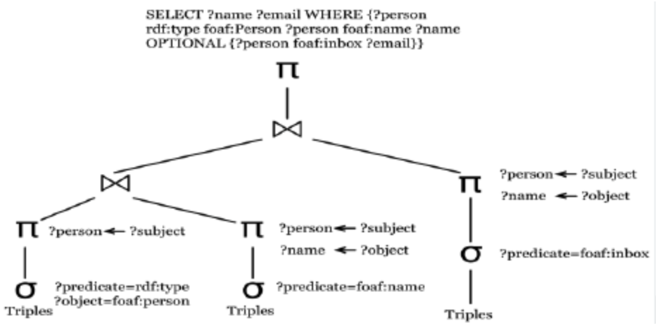

# manysql

**A generator of synthetic SQL dialects + the verification harness and RL
environment to use them as LLM training data.**

> Audience: engineers familiar with SQL but not necessarily with query
> engine internals. Goal: by the end, you should be able to predict which
> design decision was forced by which property of SQL.

Outline:

1. SQL language properties (and why they matter for what comes next)
2. Environment design — options considered, and why we settled on
   generic engine + deterministic knobs + LLM lanes
3. Pipeline / engine design — IR scope, dialect package, decision rule,
   codegen pipeline, executor + lanes
4. Training & evaluation — RL env, reward design, training setup,
   model choice, evaluation harness
5. Future experiments — scaling sweeps, curriculum changes, and the
   generalization probes that test the project's thesis

---

## 1. SQL language properties

The design decisions that show up in section 2+ are forced by *facts about SQL*,
not by taste. This section is the prior. Five claims:

1. SQL is layered: **lexical → syntactic → semantic**. Each layer varies
   independently across real-world dialects.
2. **Surface ≠ semantics.** Two queries that look character-for-character
   identical can return different rows on different engines.
3. The silent-semantic divergence catalog is real, recurring, and *small*.
4. **Relational algebra is the common substrate** — every Tier-A SQL
   dialect lowers to ~14 operators.
5. SQL has a **clean scope boundary**. Cypher / jq / streaming / procedural
   are not SQL.

---

### 1.1 SQL is layered

Three roughly-independent layers of variation:

| Layer | What varies | Examples |
|---|---|---|
| **Lexical** | tokens, comments, quotes, identifier folding | `--` vs `#` vs `//` comments; `"id"` vs `` `id` `` vs `[id]`; lowercase vs UPPERCASE folding of bare identifiers |
| **Syntactic** | clause keywords, operator spellings, clause shapes | `LIMIT n` vs `OFFSET … FETCH NEXT n` vs `TOP n`; `||` vs `+` vs `CONCAT(...)`; `CAST(x AS T)` vs `x::T` vs `CONVERT(T, x)` |
| **Semantic** | how the same plan executes against the same data | `NULL` ordering on `ORDER BY`; `1/0` returning `NULL` vs erroring; `COUNT(*)` on empty group returning 0 vs NULL |

> **Implication for the design:** these layers can be parameterized
> independently. A change to identifier folding doesn't ripple into
> grammar; a change to `LIMIT` syntax doesn't ripple into the executor.
> This is what lets us split codegen into a small set of orthogonal
> knobs in section 2.

---

### 1.2 Surface ≠ semantics

The same query, byte-for-byte, on the same data, can return different rows.

```sql
SELECT id, name FROM employees ORDER BY manager_id;
-- Postgres:   NULLs LAST  on ASC by default
-- MySQL:      NULLs FIRST on ASC by default

SELECT 1 / 0;
-- Postgres:   ERROR: division by zero
-- MySQL:      NULL
-- Snowflake:  ERROR
-- (no engine returns +Inf, but the IEEE-754 path exists for floats)

SELECT * FROM t WHERE name LIKE 'Alice';
-- Postgres:   case-sensitive
-- SQLite:     case-insensitive (ASCII)
-- MySQL:      depends on collation

SELECT 5 / 2;
-- Postgres:   2     (integer division, truncating)
-- MySQL:      2.5   (always promotes)
-- SQLite:     2     (truncating)
```

> **Implication:** a "translate to dialect X" approach that only rewrites
> tokens (a transpiler) cannot capture this. The model has to *know* the
> semantic divergence; the system has to *verify* it executed against
> the right semantics. This kills option (a) in section 2.

---

### 1.3 The silent-semantic divergence catalog is small and enumerable

Across Postgres / MySQL / SQLite / Snowflake / DuckDB / SQL Server / Oracle /
DB2 / Trino / Spark, the recurring axes of *runtime* divergence form a
~15-knob list:

| Axis | Closed enum |
|---|---|
| Identifier case folding | lower / upper / preserve |
| Null order on ASC / DESC | first / last (per direction) |
| Divide by zero | null / error / inf |
| Integer division | truncate / promote |
| `LIKE` case sensitivity | sensitive / insensitive |
| `ILIKE` supported | yes / no |
| String concat operator | `\|\|` / `+` / `CONCAT()`-only |
| Default for `UNION`/`INTERSECT`/`EXCEPT` | distinct / all |
| Boolean truthiness | strict / C-style |
| `COUNT(DISTINCT NULL)` | excluded / included |
| `SUM` on empty | null / 0 |
| Window default frame | range / rows / unbounded |
| `GROUP BY <select alias>` accepted | yes / no |
| Set-op precedence | ANSI / `INTERSECT`-tighter |
| Null-safe equality | supported / not |

This is the entire `SemanticConfig` (`manysql/spec/semantics.py`). 15 small
enums × ~3 values each = the **closed-world knob surface** that covers the
bulk of practical Postgres ↔ Snowflake ↔ Databricks ↔ Trino divergence.

> **Implication:** if the divergence space were continuous or
> domain-specific, we'd be stuck with per-dialect engines. Because it's
> enumerable, one parameterized executor handles all of them. The engine
> reads from `SemanticConfig` at every decision point.

---

### 1.4 But the long tail is open-world

Not everything is a small enum. The escape hatches we'll need:

- **Collations** — `Latin1_General_CI_AS` is one of dozens; you don't
  enum them, you ship a comparator.
- **Custom functions** — `TRY_CAST`, `NVL`, `IFNULL`, `MID`, `STRPOS`,
  `INSTR`. Names alias each other but bodies sometimes differ.
- **Plan-shape sugar** — `LIMIT N WITH TIES`, `QUALIFY`, `PIVOT`. The
  *intent* is expressible in canonical IR, but the surface produces a
  marker the executor doesn't recognize.
- **Locale-sensitive comparison, custom rounding modes, etc.**

> **Implication:** alongside the closed-world knobs, we need a small
> number of *open-world per-dialect lanes* — Python modules a dialect
> can drop in to extend the runtime. This becomes `lowering.py`,
> `overrides.py`, `passes.py`, `effects.py` in section 2.

---

### 1.5 Relational algebra is the common substrate

Across every Tier-A SQL dialect, the IR is the same ~14 operators:

```
Scan, Project, Filter, Join (inc. SEMI/ANTI),
Aggregate, Window, Sort, Limit, Distinct,
SetOp (UNION/INTERSECT/EXCEPT), WithCTE, RecursiveCTE, Apply
```

A `SELECT … FROM … WHERE … GROUP BY … HAVING … ORDER BY … LIMIT` is just
sugar for `Limit(Sort(Filter(Aggregate(Filter(Scan)))))`. The shape of
that tree does not change between Postgres and Snowflake — only the
runtime config does.



> *The same trick works for query languages over fundamentally
> different data models. Above: a SPARQL query lowered into a
> relational-algebra operator tree — π/σ/⋈ over scans, the same
> alphabet used here. Source: ResearchGate
> [figure 7, "Representation of SPARQL query in relational algebra"](https://www.researchgate.net/figure/Representation-of-SPARQL-query-in-relational-algebra_fig7_273139039).*
>
> **Implication:** one IR + one executor + per-dialect parsers and
> lowerings is enough. No N-engines fork. Dialect divergence lives in
> data (`SemanticConfig`) plus four small per-dialect modules — not in
> the executor's source code.

---

### 1.6 SQL has a clean scope boundary

The previous five claims tell us *what's true about SQL*; this one
tells us *which SQL we're going to accept*. The scope is a single
sentence:

> **Tier-A SQL: relational algebra over batch, single-source,
> read-only data.** Anything that lowers cleanly into the ~14
> operators from 1.5 is in scope. Anything that needs a structurally
> different IR is not.

#### What's in (the positive scope)

A dialect can use the engine if its queries fit the following
surface envelope. This is intentionally broad — it's basically
"Tier-A ANSI SQL plus the divergences from 1.3 / 1.4":

| Feature class | Representable in v1 |
|---|---|
| Core SELECT pipeline | `SELECT … FROM … WHERE … GROUP BY … HAVING … ORDER BY … LIMIT [OFFSET]` |
| Joins | `INNER` / `LEFT` / `RIGHT` / `FULL` / `CROSS`, plus `SEMI` / `ANTI` (used to lower `IN` / `EXISTS`) |
| Subqueries | scalar, `IN`, `EXISTS`, correlated (lowered via `Apply`) |
| Set operations | `UNION` / `INTERSECT` / `EXCEPT`, both `ALL` and `DISTINCT` variants |
| CTEs | non-recursive (`WITH`) and single-binding recursive (`WITH RECURSIVE`) |
| Window functions | full `OVER (PARTITION BY … ORDER BY … frame)` shape |
| `DISTINCT`, `LIMIT n` / `WITH TIES`, `QUALIFY` | yes (some via `passes.py` desugaring) |
| Scalar / aggregate / window calls | as expression nodes in `manysql/ir/expr.py` |
| Closed-world runtime divergences | the 15 axes from 1.3, all parameterized by `SemanticConfig` |
| Open-world long tail | collations, novel functions, plan-shape sugar — via the four per-dialect lanes from 1.4 |

Coverage claim: this is enough to capture the bulk of practical
Postgres ↔ Snowflake ↔ Databricks ↔ Trino divergence at both the
surface and silent-semantic layers. It's also enough to land all 50
questions of the `manysql-eval` benchmark and to drive RL on real
NL→SQL corpora (BIRD, SynSQL, WikiSQL).

What's deliberately *deferred* but still in the SQL family — arrays /
structs / maps, JSON path expressions, regex-flavor knobs, sampling,
`MERGE` / `UPSERT`, `PIVOT` / `UNPIVOT`, time-travel scans — is
**Tier B**: each one is *additive* (grows the IR by adding a node,
never redesigns an existing one) and lands behind an explicit RFC
under `manysql/ir/rfcs/` when a target dialect motivates it. So
Tier A today keeps working after any Tier B lands tomorrow.

#### What's out (and why)

What the IR cannot represent, and we're explicit it never will:

- Graph traversal (Cypher, GQL)
- Tree / path queries (XPath, XQuery, jq)
- Pipeline-style (KQL, PRQL chains)
- Streaming / event-time (windowing over unbounded streams)
- Probabilistic queries
- Procedural extensions (PL/SQL, T-SQL stored procs with variables,
  loops, exceptions)

Each of these violates the "lowers to ~14 relational operators"
contract: a graph traversal needs path semantics the algebra doesn't
express; jq is a tree walk over heterogeneous documents; KQL is a
pipeline with sequential rebinding; streaming needs event-time +
watermarks; PL/SQL needs a control-flow IR. They need a different
system with a weaker structural assumption (typically a tagged AST
plus a generic interpreter, no fixed algebra). `manysql/ir/SCOPE.md`
is the contract that records this.

#### Why we drew the boundary here

Three reasons, all forced by section 1's properties:

1. **The relational-algebra substrate is finite (1.5).** Locking the
   IR to a closed operator set is what lets *one* executor + *one*
   set of oracles serve every dialect. The moment we accept "maybe
   this IR node exists, maybe not," the executor and every oracle
   become best-effort instead of exhaustive.
2. **The closed-world divergence catalog is small (1.3).** Most of
   what makes "dialect X" different from "dialect Y" is *runtime
   semantics on the same plan shape*, not new shapes. Scope-locking
   the shapes lets us push divergence into `SemanticConfig` data
   instead of executor branches.
3. **The long tail is bounded by the four lanes (1.4).** Anything
   that doesn't fit a closed enum but still lowers to Tier A lives
   in a per-dialect Python module — `lowering.py`, `passes.py`,
   `overrides.py`, `effects.py` — that the engine consults at
   well-defined hook points. So "novel function," "exotic plan-shape
   sugar," and "weird collation" are all in-scope without expanding
   the IR.

> **Implication:** by scope-locking *up front*, every later design
> decision can assume "the input is a Tier-A SQL plan." Codegen
> targets a fixed shape, not a moving one; the executor is exhaustive,
> not best-effort; cross-dialect differential testing is well-defined
> (same plan, different config → row-level disagreement is the signal).
> That assumption would not hold if we tried to be a generic "query
> language generator," and the rest of the system would be 5× larger
> and worse.

---

### 1.7 Section recap — what the rest of the design has to honor

| SQL property | Force on the design |
|---|---|
| Surface ≠ semantics | Token-level transpilation isn't enough. The system must *execute* candidate SQL under the dialect's actual runtime. |
| Layered (lex / syn / sem) | Codegen should parameterize the layers independently — orthogonal knobs. |
| Closed-world divergence catalog (~15 axes) | A small enum-driven config can cover most of it (`SemanticConfig`). |
| Long tail exists (collations, novel funcs, plan sugar) | Need per-dialect Python escape hatches alongside the enums. |
| Rel-algebra substrate | One IR, one executor, parameterized — not N forks. |
| Clean scope boundary | Lock IR to Tier-A; refuse out-of-scope dialects by design. |

Hold these in your head — section 2 will name each one as it shows up.

---

## 2. Environment design

The problem we're trying to solve, very concretely:

> Given a `DialectSpec` describing how a dialect diverges from ANSI,
> produce something we can:
>
> 1. **Parse** SQL written in that dialect,
> 2. **Execute** that SQL against in-memory data and get *correct* rows,
> 3. **Verify** that the execution agreed with what the dialect was
>    supposed to mean,
>
> at low marginal cost per dialect, scaling to hundreds of synthetic
> dialects, so an LLM can be trained / evaluated against them.

We considered four architectures before landing on the fifth. Each had a
fatal property given the SQL properties from section 1.

---

### 2.1 Option A — Transpilers (rewrite ANSI SQL into the target surface)

**Idea:** the LLM emits ANSI SQL; we lexically rewrite it to the synthetic
dialect's surface; we run the rewritten string on a real engine
(Postgres, DuckDB, SQLite).

Concretely: `LIMIT 10` → `OFFSET 0 ROWS FETCH NEXT 10 ROWS ONLY`,
`||` → `+`, `CAST(x AS INT)` → `x::INT`, etc.

**Why it fails (against properties from section 1):**

1. **Surface ≠ semantics (1.2).** A transpiler can rewrite tokens, but
   it can't fix the model's mental model of *what the dialect means*.
   If the dialect says `1/0 → +Inf` and the LLM expected `NULL`, no
   amount of token rewriting fixes the answer.
2. **The LLM never has to learn the dialect.** It's just emitting ANSI.
   This defeats the entire training goal: we want the model to natively
   speak novel surfaces, not lean on a translator.
3. **Verification asymmetry.** The transpiler has to know the LLM's
   intent to rewrite correctly. If the LLM means "concat" with `+`, the
   transpiler can only guess from operand types — and if it guesses
   wrong, the reward signal is corrupted.
4. **Coverage cliff.** Plan-shape divergences (`QUALIFY`, `WITH TIES`,
   pivot) and silent semantics (null order, divide-by-zero) are not
   reachable from token rewriting at all.

**Verdict:** rejected. Doesn't actually train the model on the dialect;
turns the project into "generate transpilers."

---

### 2.2 Option B — LLM as world model / state machine

**Idea:** instead of a real engine, use a (cheap) LLM as the executor —
prompt it with the dialect's spec card and the candidate SQL, ask it to
"play SQLite" and return rows. The training agent gets feedback from a
second LLM acting as the environment.

Variant: a state-machine prompt that walks the LLM through "parse →
plan → execute → return rows."

**Why it fails:**

1. **Stochastic feedback breaks RL.** GRPO / RLVR require a deterministic,
   reproducible reward function. If the same SQL on the same data gives
   different rows across calls, the policy gradient is noise.
2. **LLM-as-judge is unreliable for SQL execution.** Hallucinated rows,
   forgotten `WHERE` clauses, made-up join cardinalities. Empirically:
   even GPT-4-class models can't faithfully execute a 4-table join on
   100 rows of data. The error rate is many percent — and the *errors
   correlate* with the agent's own systematic mistakes, which is the
   worst possible bias.
3. **Cost compounds.** Every step of every episode is now an LLM call.
   1000 training tasks × 5 turns × 8 group rollouts = 40k extra calls
   per training step.
4. **No ground truth.** We're training one model against the biases of
   another. There is no fixed point we converge toward; the "correct
   answer" drifts with the world model.
5. **Doesn't honor section 1.5.** Rel algebra is a *deterministic*
   substrate. Replacing it with a probabilistic interpreter throws away
   the structure that makes verification cheap.

**Verdict:** rejected. Training signal would be dominated by world-model
noise, not policy quality.

---

### 2.3 Option C — Real engines for real dialects (Postgres / Snowflake / …)

**Idea:** spin up actual database engines via Docker / drivers / accounts,
one per real-world dialect. Run candidate SQL against the engine; trust
its result.

**Why it fails:**

1. **Doesn't extend beyond what exists.** The whole point is *synthetic*
   dialects — we want hundreds of variants the model has never seen.
   You can't `docker run -it OracleClone47`.
2. **SemanticConfig divergences aren't independently controllable on
   real engines.** You can't ask Postgres to behave like Snowflake on
   one knob and like SQLite on another. Real engines pin the whole
   tuple of knobs at once.
3. **Operational weight.** Drivers, network, credentials, version
   pinning, flaky CI, schema-creation overhead per task. RL needs
   thousands of executions per minute; real engines deliver tens.
4. **Closed scope.** Even with N real engines, the *catalog* of
   divergences we can train on is whatever those engines happen to
   exhibit — not what we want to teach.

**Verdict:** rejected as the primary strategy. Real engines remain
*useful* as cross-checking oracles (DuckDB / SQLite oracles are part of
the verification harness), but they aren't the runtime under test.

---

### 2.4 Option D — One hand-written engine per dialect

**Idea:** for each dialect, write a small Python interpreter that parses
and executes its surface natively. Faithful but bespoke.

**Why it fails:**

1. **Doesn't scale.** Every new dialect is days of engineering. Fine
   for 3 dialects; impossible for 300.
2. **Bug-for-bug reproduction.** Each engine has its own corners,
   discoverable only by running queries against it. We'd be re-creating
   the entire dialect-divergence problem inside our own codebase.
3. **No cross-dialect differential testing.** The same logical query
   has a different *plan representation* in every engine, so we can't
   say "these two dialects should disagree exactly here."
4. **Doesn't honor section 1.5.** If rel algebra is the substrate, the
   N forks share 95% of their code. Forking N times is the wrong
   abstraction.

**Verdict:** rejected. Right answer for a database company; wrong
answer for a synthetic-dialect generator.

---

### 2.5 Option E — Generic query engine + deterministic knobs + LLM lanes (chosen)

The architecture:

```
DialectSpec (Pydantic)
    │
    ▼
┌──────────────────────────────────────────────────────────────────┐
│ codegen pipeline:                                                │
│   deterministic emitters (templated from the spec)               │
│       └─► LLM refine loop (only when templates can't express)    │
│                                                                  │
│   emits a dialect package on disk:                               │
│     grammar.lark      semantics.json    overrides.py             │
│     lowering.py       passes.py         effects.py               │
└──────────────────────────────────────────────────────────────────┘
    │
    ▼
┌──────────────────────────────────────────────────────────────────┐
│ shared runtime (one copy, scope-locked):                         │
│   IR  ──►  Polars/PyArrow executor parameterized by              │
│           SemanticConfig + per-dialect overrides/passes/effects  │
│   oracle harness (DuckDB / SQLite / reference interpreter /      │
│           property / cross-dialect differential)                 │
└──────────────────────────────────────────────────────────────────┘
    │
    ▼
   eval (NL→SQL benchmark) + RL env (GRPO over synthetic dialects)
```

Two extension surfaces, by design:

| Surface | World | Covers |
|---|---|---|
| **Closed-world knobs** (`SurfaceSpec`, `SemanticConfig`) | enum-driven | The bulk of practical divergence — section 1.1 + 1.3 |
| **Open-world per-dialect Python lanes** (`lowering.py`, `overrides.py`, `passes.py`, `effects.py`) | code | The long tail — section 1.4 |

#### Why we thought a single shared executor was tractable

The bet of section 2 is that *one* executor can serve N dialects without
collapsing under per-dialect special cases. That bet rests on three
properties of the substrate, all argued earlier:

- **The IR is closed (1.5).** Tier-A relational algebra has a fixed,
  small operator set. Every dialect's surface lowers to the *same* IR,
  so the executor's dispatch is closed at design time — there is no
  "what if a new dialect introduces a new node" risk.
- **Semantic divergence is enumerable (1.3).** All cross-dialect
  behavioral knobs (NULL ordering, divide-by-zero, integer division,
  comparison strictness, …) are typed fields on `SemanticConfig`. The
  executor reads from this config at branch points; it doesn't have a
  branch *per dialect*. N dialects cost N config records, not N forks
  of a switch statement.
- **The long tail is shunted out of the executor (1.4).** Anything
  that *can't* be expressed as a closed-world toggle becomes a
  per-dialect Python lane (`overrides.py`, `passes.py`, `effects.py`)
  that the executor consults by name. New dialect oddities don't grow
  the executor — they grow that dialect's package.

So the executor's job reduces to: walk a fixed IR, dispatch on a closed
operator set, read a small config object, and call into named
per-dialect hooks at a handful of registered sites. The dialect
explosion happens *outside* its source.

#### What it actually cost

The bet held with room to spare. The full shared executor — every
dialect on disk, every benchmark question, every RL rollout flows
through this code — is **1,500 lines**:

```
manysql/executor/engine.py     ████████████████████████████   810
manysql/executor/expr_eval.py  ███████████████████████        679
manysql/executor/__init__.py   ▏                                11
                               ──────────────────────────────────
                                                              1,500
```

| File | Lines |
|---|---:|
| [`manysql/executor/engine.py`](manysql/executor/engine.py) | 810 |
| [`manysql/executor/expr_eval.py`](manysql/executor/expr_eval.py) | 679 |
| [`manysql/executor/__init__.py`](manysql/executor/__init__.py) | 11 |
| **Total** | **1,500** |

The closed IR it dispatches over (`manysql/ir/`, also fully
dialect-agnostic) adds another 968 lines, putting the entire shared
runtime — engine *and* IR — at **2,468 lines**. Option D (one engine
per dialect) would have multiplied this by N; option C (real engines)
gave up the parameterization entirely. Neither is reachable in 1.5k
lines.

(Concrete file layout, what each lane covers, and the decision rule for
"where does feature X live" are in section 3.)

---

### 2.6 Why this option dominates each rejected one

| Concern | Option A (transpile) | Option B (LLM world model) | Option C (real engines) | Option D (per-dialect engines) | **Option E (chosen)** |
|---|---|---|---|---|---|
| Model has to learn the dialect | ✗ | ~ | ✓ | ✓ | **✓** |
| Deterministic feedback | ✓ | ✗ | ✓ | ✓ | **✓** |
| Scales to hundreds of synthetic dialects | ✓ | ✓ | ✗ | ✗ | **✓** |
| Per-knob independent control | ✗ | ~ | ✗ | ✓ | **✓** |
| Cheap per-execution (RL-friendly) | ✓ | ✗ | ✗ | ✓ | **✓** |
| Cross-dialect differential testing | ✗ | ✗ | ~ | ✗ | **✓** |
| Long-tail extensibility | ✗ | ✓ | ✗ | ✓ | **✓** |
| One executor, one IR | n/a | n/a | ✗ | ✗ | **✓** |

---

### 2.7 Section recap — what the chosen architecture commits to

- **One IR** (closed, Tier-A relational algebra) — because of 1.5.
- **One executor** parameterized by `SemanticConfig` — because of 1.3.
- **One parser per dialect** (`grammar.lark` + `lowering.py`) — because
  of 1.1.
- **Open-world Python lanes** for the long tail — because of 1.4.
- **Scope-locked** to Tier-A SQL — because of 1.6.

What we *don't* do, and why:

- We don't transpile (option A; can't capture semantic divergence).
- We don't use LLM-as-judge / world-model executors (option B;
  non-deterministic, biased, expensive).
- We don't depend on N real engines as the runtime under test
  (option C; doesn't scale; closed-world coverage gaps).
- We don't fork an executor per dialect (option D; impossibly
  expensive; throws away the rel-algebra substrate).

The next section makes this concrete: the IR's exact scope, what a
dialect package looks like on disk, the rule for where every dialect
feature lives, and how the codegen pipeline + executor are wired
together.

---

## 3. Pipeline / engine design

Section 2 picked the architecture. This section walks down a level:

- **3.1** — IR scope coverage (Tier A / B / C). The single load-bearing
  decision; everything else flows from it.
- **3.2** — The dialect package: a directory of files on disk.
- **3.3** — The four-lane decision rule for "where does feature X live?"
- **3.4** — Codegen pipeline: `DialectSpec` → emitted package, with
  deterministic baseline + LLM refine + rollback.
- **3.5** — Meta-pipeline: free-form prompt → N `DialectSpec`s → N
  packages. Minimal by design; diversity is the only real principle.
- **3.6** — Engine: one Polars/PyArrow executor + per-dialect lanes
  attached at runtime.
- **3.7** — Codepath walkthrough: one query, end to end. SQL string
  → Lark parse tree → IR Plan → Polars DataFrame, with real code
  from the repo at each stage.
- **3.8** — Engine performance — parity with real Postgres at 200k
  rows (sanity check that the generic engine isn't asymptotically
  pessimal).
- **3.9** — Case study: anatomy of one freshly-generated hybrid
  (`snowdb2_dotmod_nullsafe`) — what comes out of 3.4–3.5, side-by-side
  with `postgres_clone`, and how little of the engine it actually moves.
- **3.10** — Meta-pipeline output audit: of the 34 campaign-generated
  dialects on disk, how many shipped byte-identical to the deterministic
  baseline, and what hunks did the LLM polish actually contribute? With
  a code diff of `snowdb2_dotmod_nullsafe`'s LLM-authored grammar /
  lowering deltas.

#### System shape at a glance

(Lifted verbatim from [`README.md`](README.md), so the slide and the
repo agree.)

```
DialectSpec  ─┐
              ├─►  codegen pipeline  ─►  dialect package on disk
              │      (deterministic emitters + LLM refine loop)         │
              │                                                         │
              │                                            ┌────────────┴────────────┐
              │                                            ▼                         ▼
              │                                       parse battery            IR-equivalence
              │                                       (Lark grammar)           battery (lowered
              │                                                                Plans match the
              │                                                                reference Plans)
              │
              │   shared infrastructure (hand-written, scope-locked):
              │   ├─ logical-plan IR (relational algebra, Tier-A only)
              │   ├─ Polars/PyArrow executor parameterized by SemanticConfig
              │   ├─ multi-oracle harness (DuckDB, SQLite, ref interpreter,
              │   │  property oracle, cross-dialect differential)
              │   └─ Parquet-backed deterministic test catalog
              │
              └─►  manysql-eval benchmark
                   (NL question → LLM SQL → executor → score against reference,
                   pluggable across SQLite / Tinybird / synthetic-dialect backends)
```

#### Engine-design planning docs (in-tree)

The presentation distills three design docs that already live in
the repo. Cite these on the slide if you want the deep dive:

| Doc | What it locks in |
|---|---|
| [`manysql/ir/SCOPE.md`](manysql/ir/SCOPE.md) | The IR scope contract — Tier A operators, Tier B RFC-gated additions, Tier C out-of-scope languages. The single load-bearing decision (3.1). |
| [`manysql/ir/rfcs/0002-passes-and-effects.md`](manysql/ir/rfcs/0002-passes-and-effects.md) | The four-lane extension RFC: `passes.py` and `effects.py` formal contracts, the v1 effect registry, worked examples (`_test_with_ties`, `_test_ci_eq`), verification budget. The contract behind 3.3 and 3.6. |
| [`manysql/ir/rfcs/0001-tier3.md`](manysql/ir/rfcs/0001-tier3.md) | The v1.5 Tier-B IR-extension roadmap (arrays / structs / JSON / regex flavor / sampling / time travel / MERGE / pivot). What 3.1's "Tier B" bucket actually contains. |

---

### 3.1 IR scope coverage — Tier A locked, Tier B RFC-gated, Tier C out of scope

The single most load-bearing decision in the whole system is what the
IR can represent. Every other component — executor, oracles, codegen,
eval, RL env — honors this contract. Three tiers, defined in
[`manysql/ir/SCOPE.md`](manysql/ir/SCOPE.md).

#### Tier A — natively in v1, locked

Fourteen operators that lower every Tier-A SQL query:

```
Scan, Project, Filter, Join (incl. SEMI/ANTI),
Aggregate, Window, Sort, Limit, Distinct,
SetOp (UNION / INTERSECT / EXCEPT), WithCTE, RecursiveCTE,
Apply (dependent join, for correlated subqueries)
```

Scalar / aggregate / window calls and scalar / `EXISTS` / `IN`
subqueries are **expression** nodes (`manysql/ir/expr.py`).

Coverage: `SELECT … FROM … WHERE … GROUP BY … HAVING … ORDER BY …
LIMIT`, all join types, set ops, non-recursive + recursive CTEs,
correlated subqueries, window functions. This is enough for the bulk
of practical Postgres ↔ Snowflake ↔ Databricks ↔ Trino divergence at
the surface and silent-semantic layers.

All Tier-1 *runtime* divergence (the section-1.3 catalog) lives in
`SemanticConfig`, not in IR shape. Two dialects with the same Plan
but different `SemanticConfig` legitimately produce different rows.

#### Tier B — additive, RFC-gated, deferred

Each via an explicit RFC under `manysql/ir/rfcs/`:

| Extension | New IR shape it adds |
|---|---|
| Typed values | arrays / structs / maps; `Unnest` / `Flatten` |
| JSON | path expressions, typed JSON column |
| Regex | flavor knob (POSIX / PCRE / Java) + `RegexMatch` |
| Sampling | `Sample` node (Bernoulli / system-block) |
| MERGE / UPSERT | DML extension (only if DDL/DML enters scope) |
| Pivot / Unpivot | sugar over `Aggregate` + `CASE`, or first-class node |
| Time travel | versioned `Scan` (`AT VERSION`, `BEFORE TIMESTAMP`) |

**Important property**: Tier-B extensions *grow* the IR by adding
nodes. They don't redesign existing ones. So a Tier-A dialect today
keeps working after Tier-B lands tomorrow.

#### Tier C — explicitly out of scope, by design

Cannot be represented in this IR without becoming a different IR.
Generating dialects of these is **explicitly out of scope** for
manysql; they would require a sibling system with a weaker structural
assumption (a tagged AST + generic interpreter, no fixed algebra):

- Graph traversal (Cypher, GQL)
- Tree / path query (XPath, jq)
- Pipeline-style (KQL, PRQL)
- Streaming (windowing over unbounded streams)
- Probabilistic queries
- Procedural (PL/SQL / T-SQL stored procedures with loops, exceptions)

#### Why scope-locking is load-bearing

Every IR node is a contract honored by **three** components:

- the executor (must dispatch),
- every oracle (must produce reference rows for it),
- every generated dialect's `lowering.py` (must emit it correctly).

A silent IR addition breaks all three. The RFC process forces the
author to spec the executor changes, the oracle plan, and any new
`SemanticConfig` knobs **before** code lands.

What scope-locking buys us:

- The executor is **exhaustive**, not best-effort. Every IR node has
  a handler.
- Oracles are **exhaustive**, not best-effort.
- Cross-dialect differential testing is well-defined: same plan,
  different config → row-level disagreement is the signal.
- Codegen targets a **fixed shape**, not a moving one.

> Section 1.6 said SQL has a clean scope boundary. Tier A / B / C is
> us *enforcing* that boundary as a maintainable contract instead of
> as a vibe.

---

### 3.2 The dialect package — a directory of files

A generated dialect is a directory under `manysql/dialects/<name>/`:

```
manysql/dialects/aggressive_alien/
├── grammar.lark      # Lark grammar — surface syntax of this dialect
├── lowering.py       # parse tree → manysql IR Plan        (open-world)
├── semantics.json    # SemanticConfig values             (closed-world)
├── overrides.py      # FUNCTIONS / OPERATORS dicts        (open, optional)
├── passes.py         # PRE_EXECUTION_PASSES list           (open, optional)
├── effects.py        # EFFECTS dict                       (open, optional)
├── metadata.json     # provenance, retry log, lifecycle state
├── spec.json         # the DialectSpec this was generated from
├── battery.json      # parse + IR-equivalence batteries (machine-readable)
├── examples.sql      # parse battery rendered as inspectable dialect SQL
└── __init__.py
```

Three things to land:

**1. It's just files.** Not a Python class hierarchy, not an in-memory
registry-of-objects. You can `cat` / `diff` / `git blame` / `rsync`
a dialect. The registry (`manysql/dialects/registry.py`) is a
backend-swappable store; the v1 backend is "look in this directory."

**2. Two halves of the package — closed and open:**

| Files | World | Filled by |
|---|---|---|
| `semantics.json` | closed enums (`SemanticConfig`) | Pydantic model dump |
| `grammar.lark`, `lowering.py`, `overrides.py`, `passes.py`, `effects.py` | open Python | deterministic emitter, optionally LLM-refined |

**3. The package ships its own contract.** `battery.json` +
`examples.sql` are *inside* the package: "when parsed and lowered,
these inputs produce these IR plans." Anyone receiving the package
can rerun the contract without trusting our metadata.

`metadata.json` records the lifecycle state and *every* codegen
attempt — so when you see a dialect was LLM-refined, you can trace
which retry actually landed and what the rejected drafts looked like.
The lifecycle state machine:

```
DRAFT → GENERATING → GENERATED → VALIDATED
                              ↘ NEEDS_REVIEW
                              ↘ FAILED
                              ↘ DEPRECATED
```

---

### 3.3 The four-lane decision rule

Where does a dialect feature live? The rule, in priority order:

| Rule | Where the feature lives | Example |
|---|---|---|
| **1. Pure surface** | `SurfaceSpec` knob (closed enum) | `LIMIT n` ⇄ `OFFSET n ROWS FETCH NEXT n ROWS ONLY`; `\|\|` ⇄ `+`; `--` ⇄ `//` comments |
| **2. Runtime divergence in a small enum** | `SemanticConfig` knob (closed enum) | NULL ordering on `ORDER BY`; divide-by-zero policy; `LIKE` case sensitivity |
| **3. Canonical IR is the right *shape*, surface produces a non-canonical marker** | `passes.py` Plan→Plan rewrite | `LIMIT N WITH TIES` desugars to `Window(rank) → Filter(rank ≤ N) → Project` |
| **4. Canonical IR is the right *shape*, executor's *implementation* differs** | `effects.py` handler at a registered name | `text_eq` / `text_neq` / `text_in_pattern` for case-insensitive collation |
| **5. Canonical IR can't represent the feature at all** | Tier-B IR extension via RFC | arrays, JSON path expressions, sampling |

Each rule defends a specific invariant:

- **Rule 1** keeps the IR oblivious to surface choices.
- **Rule 2** keeps the IR oblivious to runtime semantics — runtime
  knobs are *data*, not code branches.
- **Rule 3** keeps `Plan` shape canonical; non-canonical IR markers
  are eliminated before the executor sees them, so the executor stays
  exhaustive.
- **Rule 4** keeps the executor exhaustive too — every decision point
  has either a canonical implementation or a registered effect; never
  an unhandled case.
- **Rule 5** keeps Tier-A locked; the executor + oracles never have
  to handle "maybe this node exists, maybe not."

Three real worked examples ship in the repo
([`manysql/ir/rfcs/0002-passes-and-effects.md`](manysql/ir/rfcs/0002-passes-and-effects.md)
is the contract):

| Dialect | Exercises |
|---|---|
| `_test_with_ties` | Rule 3 (`passes.py`): T-SQL `TOP N WITH TIES` desugaring. |
| `_test_ci_eq` | Rule 4 (`effects.py`): T-SQL `Latin1_General_CI_AS` collation. |
| `aggressive_alien` | Rules 1 + 2 hard: surface keyword/operator rewrites + several semantic-knob flips. |

The rule maps directly back to section 1's properties:

| Rule(s) | Forced by |
|---|---|
| 1, 2 | 1.1 (lex/syn/sem layered) + 1.3 (catalog enumerable) |
| 3, 4 | 1.4 (long tail is open-world) |
| 5 | 1.6 (scope boundary; IR additions are RFC-gated) |

---

### 3.4 Codegen pipeline — `DialectSpec` to package on disk

```
DialectSpec  ─►  deterministic emitters  ─►  parse battery   ─┐
(Pydantic)         (templated from spec)                       │
                          │                                    ▼
                          ▼                       (passes? — done, ship)
                     LLM refine loop                          │
                  (only if templates                          ▼
                   can't express, or                     IR battery
                   --use-llm forced)                          │
                          │                                   ▼
                          ▼                          rejection battery
                       rollback if                            │
                       any battery                            ▼
                       regresses                  card-conformance gate
                                                              │
                                                              ▼
                                                    package on disk
```

#### Stage 1 — Deterministic emitters

Every spec begins with a baseline emitter run
(`manysql/codegen/grammar_emit.py`, `lowering_emit.py`,
`config_emit.py`, `passes_emit.py`, `effects_emit.py`,
`overrides_emit.py`). The emitters cover **every** closed-world knob
in `SurfaceSpec` and `SemanticConfig`.

For specs whose divergence is fully covered by knobs
(`mild_postgres_ish`, `snowflake_clone`, `sqlite_clone`,
`postgres_clone`), this is the **only** stage that runs.

- Cost: milliseconds.
- Bit-reproducible across runs.
- No LLM tokens. No network. Works offline.

#### Stage 2 — LLM refine loop (optional)

Engaged when (a) the user passes `--use-llm`, (b) the spec sets
`force_llm=True`, or (c) the deterministic baseline fails the parse
battery (the spec asks for something the templates can't express,
e.g. `JoinSyntax.PIPELINED` or exotic operator spellings).

Two agents run independently — one for grammar, one for lowering —
each with the same loop:

```
1. Render the deterministic baseline.
2. Run the parse / IR battery; if it passes, done.
3. Otherwise send the LLM (a) the spec, (b) the current artifact text,
   (c) every battery failure with its source SQL and parser/IR error.
4. Replace the artifact with the LLM's reply; rerun the battery.
5. Repeat up to max_iterations (default 5).
```

#### Stage 3 — Validation gates

Four batteries gate the package before it's marked `VALIDATED`:

| Battery | Asserts |
|---|---|
| **Parse** | Every dialect-skinned SQL example parses without error. |
| **Rejection** | The grammar *refuses* reference-form syntax that the spec disallows (a dialect mandating `OFFSET … FETCH` must reject `LIMIT n`). Catches "card claims divergence but grammar quietly accepts both forms" bugs. |
| **IR equivalence** | The same logical query lowered through this dialect produces the same IR plan as through the reference dialect (modulo sentinel markers a `passes.py` would desugar). |
| **Card conformance** | The dialect *card* (the human-readable advertisement used by eval / train prompts) matches what the grammar actually accepts. |

#### Rollback discipline

If an LLM iteration regresses **any** battery vs. the previous
attempt, that iteration is discarded — the deterministic baseline is
the floor. This makes the LLM lane **strictly additive**: a dialect
can't end up worse than its deterministic baseline. Worst case, the
LLM is a no-op.

> The same closed/open pattern as the runtime, applied one level up
> to codegen itself: deterministic where deterministic works; LLM
> only where it has to; verification gates run regardless.

#### Provenance

Every retry attempt — source (deterministic vs. llm), battery report,
which iteration finally landed — is logged in `metadata.json`. So
when you `manysql-dialect diff <name>` you can see not just *what* a
dialect's grammar does but *how it got that way*.

Scaling this out — going from "one spec → one dialect" to "one prompt
→ N dialects" — is the meta-pipeline in 3.5.

---

### 3.5 Meta-pipeline — one prompt to N dialects

The codegen pipeline in 3.4 takes **one** `DialectSpec` and produces
**one** dialect package. The meta-pipeline is the outer loop: take a
free-form prompt, produce **N** `DialectSpec`s, fan them through 3.4
in parallel.

Honest framing: **we did not put a lot of design effort here**.
Anything that produced reasonably diverse specs was fine for v1
because the inner pipeline (3.4) does all the verification work
already — the meta-pipeline only has to emit *valid* `DialectSpec`s
(Pydantic-validated) and the rest is downstream's problem.

The flow:

```
free-form prior (e.g. "variants between mssql and snowflake")
+ structured knobs (theme, n, inspired_by, exclude_knobs)
        │
        ▼
1 LLM call: expand_campaign_brief
        │
        ▼  CampaignBrief (one shared context per worker)
        │
        ▼
N sequential LLM calls: design_dialect_batch
   each call sees:
     - the brief
     - the theme schedule slot (mild / moderate / aggressive)
     - a running ledger of already-drafted specs
        │
        ▼  list[DialectSpec]
        │
        ▼  ThreadPoolExecutor fan-out
        │
N parallel calls into write_dialect_package (= section 3.4)
        │
        ▼
manysql/dialects/_campaigns/<id>.json
   (config, brief, every drafted spec, per-package status)
```

The diversity story is small but load-bearing — all of it lives in
the per-slot prompt, not in fancy machinery:

| Mechanism | What it does |
|---|---|
| **Running ledger** | Each new spec request shows the LLM one-line descriptions of the specs already drafted in this campaign, so it can deliberately differ. |
| **Theme schedule** | When `theme=mixed`, divergence level rotates round-robin across `mild` / `moderate` / `aggressive` per slot. Forces a spread of difficulties. |
| **`inspired_by`** | Soft steering — list of real-world dialects to borrow ideas from (e.g. `snowflake,sql_server,oracle`). |
| **`exclude_knobs`** | Negative steering — knobs the LLM should *not* touch this campaign (so a campaign can avoid colliding with what's already in the registry). |

Why the minimalism is fine:

- **Failures are recorded, not silently dropped.** A spec that fails
  the inner-pipeline batteries lands in the campaign manifest with
  status `FAILED`. The campaign continues past individual failures.
- **No cross-campaign coordination.** Each campaign manifest is
  self-contained at `manysql/dialects/_campaigns/<id>.json`. If two
  campaigns happen to draft similar specs, that's fine — names are
  uniquified, both packages ship.
- **No "agent does the whole thing" magic.** The meta-pipeline is
  three LLM calls of small structured prompts (brief expansion + N
  spec drafts), not an open-ended agent loop. Easy to reason about,
  easy to debug.
- **The bar for "good enough" is "produces N valid `DialectSpec`s
  with low pairwise overlap."** Anything stronger would be premature.

> Could we do better? Sure — diversity-aware sampling, embedding-based
> deduplication, an explicit divergence-axis schedule, RL on the
> meta-loop itself. None of that was needed to ship v1. The bundled
> synth-generated dialects in the README (`oracle_maria_modconcat`,
> `firebird_click_wildcard`, `redshift_informix_cmpops`, etc.) all
> came out of this minimal loop, and they hit lexical / operator axes
> the previous batches missed simply because the running ledger told
> the next slot "these axes are taken."

---

### 3.6 Engine — one parameterized executor + per-dialect lanes

`manysql/executor/` is **one** Polars/PyArrow executor. Its surface:

```python
class PlanExecutor:
    def __init__(
        self,
        catalog: dict[str, pl.DataFrame],
        semantics: SemanticConfig,
        overrides: ModuleType | None = None,
        passes: ModuleType | None = None,
        effects: ModuleType | None = None,
    ): ...

    def execute(self, plan: Plan) -> pl.DataFrame: ...
```

Three things to land:

#### (a) The executor reads `SemanticConfig` at every divergence point

Pseudocode for a `Sort` node:

```python
def execute_sort(self, node: Sort, df: pl.DataFrame) -> pl.DataFrame:
    null_first = self.semantics.null_order_default_asc == NullOrder.FIRST
    # ... rest of the impl branches on null_first
```

Same plan, different `SemanticConfig` → legitimately different rows.
This is exactly the SQL property from 1.2 ("surface = semantics is a
lie"), made directly executable. Adding a knob means: add a field to
`SemanticConfig` (with a reference default), branch on it at the one
decision point, defaults preserve every existing dialect.

#### (b) Per-dialect lanes attach once at construction, not per-call

The four open-world lanes plug in at execute time, not compile time
(formal contract:
[`manysql/ir/rfcs/0002-passes-and-effects.md`](manysql/ir/rfcs/0002-passes-and-effects.md)):

| Lane | When the executor consults it |
|---|---|
| `passes.PRE_EXECUTION_PASSES` | Once, between lowering and dispatch — `apply_pre_passes(plan, semantics, passes)` |
| `overrides.FUNCTIONS` / `OPERATORS` | Per-call inside `ExprEvaluator`, before raising `NotImplementedError` |
| `effects.EFFECTS` | At named decision points (`text_eq`, `text_neq`, `text_in_pattern`); fall through to canonical impl when handler returns `None` or isn't installed |

A dialect that ships **none** of these still works — every lane is
optional. So the executor's machinery is paid for once, regardless of
whether you have 3 dialects or 300.

The v1 effect registry is intentionally small (RFC 0002, §"v1 effect
registry"):

| Effect name | Replaces | Worked-example dialect |
|---|---|---|
| `text_eq` | `Op.EQ` Polars impl in `ExprEvaluator._binary` | `_test_ci_eq` (T-SQL `Latin1_General_CI_AS` collation) |
| `text_neq` | `Op.NEQ` Polars impl | `_test_ci_eq` |
| `text_in_pattern` | `Op.LIKE` / `Op.ILIKE` pattern dispatch | (collation-aware LIKE) |

The registry is closed-world (grows only via RFC); the *handlers* a
dialect populates are open-world. New effects land case-by-case as
target dialects motivate them — same shape as Tier-B IR extensions
in 3.1.

#### (c) One IR + one executor → cross-dialect differential testing is free

The same `Plan` runs through every dialect's
`(SemanticConfig + lanes)` tuple. A row-level disagreement between
dialects on the same plan is either:

- a **real, intended semantic divergence** — training signal; the
  dialect card explains why, or
- a **codegen bug** — one of the dialects mis-models its own knob.

Both cases are valuable. Neither is reachable in the per-dialect-engine
option from 2.4.

#### Putting the lanes back-to-back with the rule

```
Plan input
   │
   ▼
PRE_EXECUTION_PASSES          ← passes.py        (rule 3)
   │
   ▼
canonical Plan dispatch
   │
   ▼
each operator handler:
    reads SemanticConfig at every decision point  ← rule 2
    consults effects.EFFECTS at registered names  ← rule 4
    consults overrides.FUNCTIONS / OPERATORS      (open-world bodies)
   │
   ▼
output DataFrame
```

The same five-rule decision tree from 3.3 determines, at runtime,
which lane the executor takes for any given operation. The codegen
pipeline and the runtime engine are reading from the same playbook.

---

### 3.7 Codepath walkthrough — one query, end to end

3.6 named the components; this section follows one specific query
through them, top to bottom. **Every line of code below is from the
actual repo** — no pseudocode, no simplification beyond eliding
imports and unrelated branches. By the end you should be able to
point at any stage and say "this is the box doing X."

The query (chosen because it's small but exercises five different IR
operators):

```sql
SELECT region, count(*) AS n
FROM employees
WHERE active = TRUE
GROUP BY region
ORDER BY n DESC
LIMIT 3
```

Run it through `postgres_clone` against the standard golden catalog
and you get back three rows: `{NA, 4}`, `{EU, 3}`, `{APAC, 1}`.
Here's how those rows happen.

```
SQL string                                    "SELECT region, count(*) ..."
   │                                                       │
   │  ① Lark parser (grammar.lark)                         │
   ▼                                                       ▼
parse tree                                   Tree('start', [Tree('statement', [...])])
   │
   │  ② Lowering (lowering.py): tree-walk → IR Plan
   ▼
IR Plan                                      Limit(Sort(Aggregate(Filter(Scan('employees')))))
   │
   │  ③ Pre-execution passes (passes.py)  — usually a no-op
   ▼
canonical Plan                               (same shape; no sugar to desugar here)
   │
   │  ④ PlanExecutor._dispatch  (one handler per node type)
   ▼
Polars DataFrame                             ┌────────┬───┐
                                             │ region │ n │
                                             │  NA    │ 4 │
                                             │  EU    │ 3 │
                                             │  APAC  │ 1 │
                                             └────────┴───┘
```

Four stages. Each is one Python file (or one method on one class).

#### Stage 1: parse — Lark turns the string into a tree

The dialect's grammar lives in `manysql/dialects/postgres_clone/grammar.lark`.
Excerpts covering the rules our query hits:

```26:32:manysql/dialects/postgres_clone/grammar.lark
select_core: "SELECT"i distinct_marker? select_list "FROM"i from_clause where_clause? group_by_clause? having_clause?

distinct_marker: "DISTINCT"i  -> select_distinct | "ALL"i -> select_all_marker

where_clause: "WHERE"i expr
group_by_clause: "GROUP"i "BY"i expr_list
```

```57:59:manysql/dialects/postgres_clone/grammar.lark
order_by: "ORDER"i "BY"i order_key ("," order_key)*

!order_key: expr ("ASC"i | "DESC"i)? ("NULLS"i ("FIRST"i | "LAST"i))?
```

`DialectRuntime.setup()` (in `train/env/engine.py`) builds an Earley
parser from this text once, at construction time:

```76:87:train/env/engine.py
    def setup(self) -> None:
        from lark import Lark, LarkError  # noqa: PLC0415

        from manysql.dialects.registry import DialectRegistry  # noqa: PLC0415

        engine = DialectRegistry().load(self.dialect)
        try:
            parser = Lark(engine.grammar_text, start="start", parser="earley")
        except LarkError as exc:
            raise RuntimeError(
                f"failed to build parser for dialect {self.dialect!r}: {exc}"
            ) from exc
```

Calling `parser.parse(sql)` returns a `lark.Tree` — a labelled
n-ary tree where each node has a string `data` (the matching rule
or alias, e.g., `"select_core"`, `"order_by"`) and a `children`
list of further `Tree`s and leaf `Token`s. **No IR types yet**
— the tree is purely a record of which grammar rules matched
where. For our query, schematically (real Lark output is more
verbose; the leaves are Token strings, not the IR shorthand below):

```text
Tree('start',
  Tree('statement',
    Tree('query_expr',
      Tree('select_core',
        Tree('select_list',
          Tree('select_expr', <expr: column 'region'>),
          Tree('select_expr', <expr: count(*)>, Token('IDENTIFIER', 'n'))),
        Tree('table_ident', Token('IDENTIFIER', 'employees')),
        Tree('where_clause', <expr: active = TRUE>),
        Tree('group_by_clause', <expr: column 'region'>)),
      Tree('order_by',
        Tree('order_key', <expr: column 'n'>, Token('DESC'))),
      Tree('limit_clause', Token('INT', '3')))))
```

That's it for stage 1: parse text, get a tree. Lark errors here are
what get tagged `parse_error` in 4.2's reward shaping; everything
beyond this point is `runtime` because the SQL was structurally
valid even if it didn't mean anything.

#### Stage 2: lower — `lowering.py` walks the tree and emits IR

Each dialect ships a `lowering.py` whose only public symbol is one
function:

```142:147:manysql/dialects/postgres_clone/lowering.py
def lower(tree: Tree, config: SemanticConfig, catalog: Catalog) -> Plan:
    """Public entrypoint required by manysql.dialects.registry.DialectEngine."""
    lowerer = Lowerer(catalog=catalog, config=config)
    statement = tree.children[0]
    assert _data(statement) == "statement"
    return lowerer.lower_statement(statement)
```

`Lowerer` is a recursive descent over the parse tree that emits one
IR node per SQL clause it recognises. The IR types live in
`manysql/ir/plan.py`; they're frozen dataclasses with explicit
`schema()` and `children()` methods:

```43:49:manysql/ir/plan.py
@dataclass(frozen=True)
class Scan(Plan):
    """Scan a base table from the catalog."""

    table_name: str
    columns: tuple[ColumnSchema, ...]
    alias: Optional[str] = None
```

```77:83:manysql/ir/plan.py
@dataclass(frozen=True)
class Filter(Plan):
    input: Plan
    predicate: Expr

    def children(self) -> list[Plan]:
        return [self.input]
```

For our query, the lowerer produces:

```python
Limit(
    limit=3,
    offset=0,
    input=Sort(
        keys=(OrderKey(expr=ColumnRef("n"), direction=DESC, nulls=DEFAULT),),
        input=Aggregate(
            group_by=(("region", ColumnRef("region")),),
            aggregates=(("n", AggCall(kind=COUNT_STAR)),),
            output_types=(TEXT, INT),
            input=Filter(
                predicate=BinaryOp(EQ, ColumnRef("active"), Literal(True)),
                input=Scan(
                    table_name="employees",
                    columns=(ColumnSchema("id", INT), ColumnSchema("name", TEXT), ...),
                ),
            ),
        ),
    ),
)
```

Three things to land:

1. **The IR is a tree of frozen dataclasses, not a string.** Every
   downstream stage operates on Python objects with `.children()`
   and `.schema()`, never on text. There's no string-based "SQL
   round-trip" in the codepath.
2. **The shape exactly matches the SQL pipeline.** `LIMIT(SORT(GROUP_BY(WHERE(SCAN))))`
   — no surprises. Section 1.5's claim "every Tier-A SQL query
   lowers to ~14 operators" is, concretely, this.
3. **The `SemanticConfig` is threaded in at this stage**, even
   though our query doesn't trip any of its knobs. If the dialect's
   `boolean_truthiness = strict` and the WHERE were `WHERE active`
   (no `= TRUE`), the lowerer would either reject it or wrap it in a
   coercion — that decision is made *here*, not at execution time.

This is also where dialects diverge most. Two dialects' `lowering.py`
files might be 80% identical (e.g., everything before the `LIMIT`
clause), but the dialect with `limit_syntax = offset_fetch` reads
two integers from a `FETCH NEXT … ROWS ONLY` subtree where the other
reads one from a `LIMIT n` subtree. The IR they produce is the
same `Limit(limit=3, offset=0)` — only the *path* through the
parse tree differs.

#### Stage 3: pre-execution passes — desugar non-canonical IR (usually a no-op)

Before the executor runs, `apply_pre_passes` runs the dialect's
`PRE_EXECUTION_PASSES` list:

```97:104:manysql/executor/engine.py
    def execute(
        self,
        plan: Plan,
        *,
        outer_row: Optional[dict[str, Any]] = None,
    ) -> pl.DataFrame:
        plan = apply_pre_passes(plan, self.semantics, self.passes)
        return self._dispatch(plan, outer_row or {})
```

For `postgres_clone`, `passes.py` is empty — the IR coming out of
lowering is already canonical. For T-SQL `WITH TIES` (the
`_test_with_ties` worked example), this is where `Limit(limit=3,
with_ties=True)` gets desugared into `Filter(rank ≤ 3,
Window(rank, ...))`. Stage 3 is what keeps the executor's dispatch
table exhaustive: by the time stage 4 sees a node, that node has a
canonical implementation.

#### Stage 4: execute — `PlanExecutor._dispatch` runs Polars

The dispatcher is a single `isinstance` chain, one branch per IR
node type:

```117:144:manysql/executor/engine.py
    def _dispatch(self, p: Plan, outer_row: dict[str, Any]) -> pl.DataFrame:  # noqa: PLR0911
        if isinstance(p, Scan):
            return self._scan(p)
        if isinstance(p, Project):
            return self._project(p, outer_row)
        if isinstance(p, Filter):
            return self._filter(p, outer_row)
        if isinstance(p, Join):
            return self._join(p, outer_row)
        if isinstance(p, Aggregate):
            return self._aggregate(p, outer_row)
        if isinstance(p, Window):
            return self._window(p, outer_row)
        if isinstance(p, Sort):
            return self._sort(p, outer_row)
        if isinstance(p, Limit):
            return self._limit(p, outer_row)
        if isinstance(p, Distinct):
            return self._distinct(p, outer_row)
        if isinstance(p, SetOp):
            return self._setop(p, outer_row)
        if isinstance(p, WithCTE):
            return self._with_cte(p, outer_row)
        if isinstance(p, RecursiveCTE):
            return self._recursive_cte(p, outer_row)
        if isinstance(p, Apply):
            return self._apply(p, outer_row)
        raise NotImplementedError(f"PlanExecutor: unhandled {type(p).__name__}")
```

Each handler does exactly one thing. They recurse — `_filter` calls
`_dispatch(p.input)` to materialise its child first — so the tree
gets walked bottom-up and each level returns a Polars `DataFrame`.
For our query:

| IR node | Handler | What it actually does |
|---|---|---|
| `Scan("employees")` | `_scan` | Look up `"employees"` in `self.catalog` (a `dict[str, pl.DataFrame]`); return the DataFrame as-is. |
| `Filter(active = TRUE)` | `_filter` | Recurse → DataFrame. Build a Polars boolean expr from the IR predicate, call `df.filter(...)`. |
| `Aggregate(group_by=region, count(*))` | `_aggregate` | Recurse → DataFrame. Call `df.group_by("region", maintain_order=True).agg(...)`. |
| `Sort(n DESC)` | `_sort` | Recurse → DataFrame. Materialize the sort key, call `df.sort(..., descending=[True], nulls_last=...)`. |
| `Limit(3, offset=0)` | `_limit` | Recurse → DataFrame. Call `df.head(3)`. |

The two handlers most worth reading verbatim, because they show how
small each one is:

```168:172:manysql/executor/engine.py
    def _filter(self, p: Filter, outer_row: dict[str, Any]) -> pl.DataFrame:
        inp = self._dispatch(p.input, outer_row)
        ev = self.evaluator(outer_row)
        pred = _to_bool(ev.eval(p.predicate), self.semantics)
        return inp.filter(pred.fill_null(False))
```

```537:543:manysql/executor/engine.py
    def _limit(self, p: Limit, outer_row: dict[str, Any]) -> pl.DataFrame:
        inp = self._dispatch(p.input, outer_row)
        if p.offset:
            inp = inp.slice(p.offset)
        if p.limit is not None:
            inp = inp.head(p.limit)
        return inp
```

That's the whole executor for `LIMIT`: ~6 lines, zero branches on
dialect. The `_filter` handler is identical: build a Polars expr,
hand it to `df.filter`. The IR-to-Polars distance is genuinely that
short.

The point of `SemanticConfig` from 3.6.a shows up inside `_sort`
(NULL-ordering) and inside `_aggregate` (empty-input behavior for
`SUM`), and inside `ExprEvaluator` for things like divide-by-zero.
Same plan, same input, different `SemanticConfig` → legitimately
different output rows. The dispatcher itself is dialect-agnostic;
the per-node behavior knobs are reads off `self.semantics`.

#### What lives where, summarised

Following one query end-to-end touched four files in three
directories. Here's the map:

| Stage | File | Per-dialect or shared? | Lines of work for this query |
|---|---|---|---|
| Parse | `manysql/dialects/<name>/grammar.lark` | per-dialect | ~5 grammar rules matched |
| Lower | `manysql/dialects/<name>/lowering.py` | per-dialect | ~5 tree-handler methods |
| Pre-passes | `manysql/dialects/<name>/passes.py` | per-dialect (often empty) | 0 |
| Execute | `manysql/executor/engine.py` + `expr_eval.py` | shared | ~5 dispatch handlers, ~30 lines total |

The shape that 3.6 promised — "data + a small open-world Python
package per dialect; one shared executor" — is what this table is.
Adding a dialect adds a `grammar.lark` and a `lowering.py`; the
executor in column 4 doesn't change. That's the claim that
collapses N-engine forks (option 2.4) into a parameterised
single-engine architecture (option 2.5), spelled out in code.

#### What this codepath walkthrough doesn't show

In the interest of keeping the trace readable, three things are
elided here and described elsewhere:

- **Expression evaluation.** `ExprEvaluator` lowers IR `Expr`
  nodes (`BinaryOp`, `FuncCall`, `Cast`, `Case`, `WindowCall`,
  scalar/EXISTS/IN subqueries) to Polars expressions. Same shape as
  the plan dispatcher — one method per `Expr` type, recursive,
  reads `SemanticConfig` and `effects`/`overrides` at the relevant
  decision points.
- **`overrides.FUNCTIONS` / `effects.EFFECTS`.** The two
  per-dialect open-world expression hooks (rule 4 in 3.3, plus the
  function-override lane) plug in inside `ExprEvaluator`, not in
  the plan dispatcher. They never fire on a query like ours —
  `count(*)` and `=` are canonical IR — but a query with
  `Latin1_General_CI_AS` collation would swap `_binary` to consult
  `effects["text_eq"]` instead of Polars's default `Series.__eq__`.
- **Correlated subqueries.** `Apply` materialises the outer side,
  then runs the inner plan once per outer row with `outer_row=...`
  threaded through `_dispatch`. Slow but unambiguous; the
  `outer_row` dict in every signature above is what carries that
  binding.

With the codepath in hand, the next subsection asks the obvious
performance question: now that we know the engine is *thin*, is it
fast enough to be the system-under-test for thousands of RL rollouts
per minute? The answer is in 3.8.

---

### 3.8 Engine performance — parity with real Postgres

The choice in section 2 was "generic query engine + deterministic
knobs + LLM lanes." Two correctness benefits fell out of that —
parameterized semantics (3.6.a) and free cross-dialect differential
testing (3.6.c). But correctness alone isn't enough: the same
executor is the system-under-test for every synthetic dialect, the
system-under-eval for `manysql-eval --backend synthetic`, and the
env loop for *every* RL rollout. **If it were 100× slower than a
real database, none of that would be tractable.**

So one of the eval surfaces (`eval/perf_bench.py`) does *not* test
LLM SQL at all. It runs a curated, dialect-neutral SQL suite against
two engines on identical data, identical indexes, and an identical
warmup/repeat schedule:

1. **Real PostgreSQL 16** via `psycopg` (embedded `pgserver`, default
   config).
2. **manysql `postgres_clone`** — Lark parse → IR lowering → Polars
   execution, generated from the bundled spec example.

15 SQL statements; row-equivalence checked per query (Decimal→float
normalization, 6-dp float rounding, set-compare when there's no
`ORDER BY`).

#### Headline

| dataset | repeats | geomean (manysql / pg) | row-equivalence |
|---|---|---|---|
| 50k rows | 1 warmup + 5 timed | **3.76× (Postgres faster)** | 15 / 15 |
| **200k rows** | **2 warmup + 10 timed** | **1.03× (parity)** | **15 / 15** |

#### The crossover is the story

- **manysql carries a fixed per-query overhead** (Lark parse → IR
  lower → Polars plan build) of roughly 4–8 ms at 200k rows. That
  fraction of total runtime dominates on small datasets.
- **Polars's vectorized execution scales better** than Postgres's
  row-based engine, so by 200k rows the two engines are essentially
  tied in aggregate — with each winning on different query shapes.

#### Where each engine wins big at 200k rows

| query shape | winner | factor | why |
|---|---|---|---|
| `count(DISTINCT col)` (q03) | **manysql ~7×** | 33 ms → 4.6 ms | Polars hash-distinct on a single Utf8 column is tight; PG hash-aggregates row-by-row |
| top-N actors by distinct repos (q15) | **manysql ~9×** | 77 ms → 8.5 ms | High-cardinality `GROUP BY` (~50k actor groups) — same shape, harder for PG |
| `UNION DISTINCT` of two scans (q11) | **manysql 1.7×** | 15 ms → 9 ms | `concat + unique` < PG `HashAggregate(SetOp)` |
| `IN (SELECT ...)` semi-join (q08) | **PG 4.1×** | 5 ms → 19 ms | PG planner turns IN-subquery into a clean hash semi-join; manysql materializes the subquery and joins via membership |
| `SUBSTRING(col, 1, 7) GROUP BY` (q13) | **PG 3.2×** | 3.5 ms → 11 ms | PG folds constant-length substring into a fast text op inside the aggregator; we go through generic `str.slice` + separate `group_by` |

Everything else lives in the 1.3–1.6× band — "normal" GROUP BY +
ORDER BY shapes with mid cardinality where both engines take
comparable time.

Full per-query breakdown (all 15 queries, p50 timings, caveats,
reproduction steps): see [`eval/PERFORMANCE.md`](eval/PERFORMANCE.md).

#### Caveats worth naming on the slide

- **Embedded Postgres**, not a tuned production server. Default
  `shared_buffers`, `work_mem`, very few of these plans qualify for
  parallel scan at 200k rows. A tuned production PG would close some
  of the manysql wins on q03/q11/q15; it wouldn't change the q08/q13
  picture much.
- **Cold-start excluded**. Both engines run a warmup pass that's
  thrown away. PG bootstrap (~3 s) and manysql dialect load (~1.2 s)
  are reported once at setup, not per query.
- **Row-set equivalence ≠ semantic equivalence**. The bench checks
  `set(rows)` (or ordered list when `ORDER BY` is present) match. A
  divergence in NULL ordering, case folding, or division-by-zero on a
  query that doesn't exercise it would still pass. Semantics is
  exercised separately by the cross-dialect golden suite.

#### Why this number is the floor we needed

Three direct consequences of having the executor at PG-parity, *not*
two orders of magnitude slower:

| Downstream system | What parity buys |
|---|---|
| Codegen validation batteries | A 200-query parse / IR-equivalence battery completes in seconds, not minutes — fast enough to run as a gate every codegen attempt (3.4). |
| RL rollouts | Thousands of executions per minute. The reward function can re-execute every model SQL through the dialect runtime instead of relying on a string-match heuristic (4.2). |
| `manysql-eval --backend synthetic` | A 50-question benchmark across `--concurrency 8` returns in seconds, so the dialect runtime is a viable closed-source-engine stand-in for benchmarking. |

**Parity is the floor.** Going faster would be nice; the project
doesn't need it. Going much slower would have made the whole
architecture untenable.

---

### 3.9 Case study — anatomy of one freshly-generated hybrid

Sections 3.1–3.8 describe the machinery. This section opens up one
artifact the meta-pipeline emitted this morning and reads it cover to
cover, so the abstractions land on something concrete.

**Pick.** [`manysql/dialects/snowdb2_dotmod_nullsafe/`](manysql/dialects/snowdb2_dotmod_nullsafe/),
generated by the campaign at
[`manysql/dialects/_campaigns/20260427T204607-2a087798.json`](manysql/dialects/_campaigns/20260427T204607-2a087798.json).
The campaign's `prior` to the LLM was:

> *Hybrid dialects exercising the newly-supported axes: operator-level
> divergences (mod, concat, null-safe-eq, comparison), wildcard char
> variants, function-alias-driven dispatch, set-op precedence inversion
> (EXCEPT/INTERSECT bind tighter than UNION), and quoting variants. Each
> slot must headline at least one operator/lexical axis the prior
> campaigns missed silently.*

The LLM produced 10 hybrid `DialectSpec`s in that batch; we picked the
one with the most visually distinctive surface. Filed under **moderate**
divergence; parents are **Snowflake / DB2 / SQL Server**.

#### What's in the box

The standard 8-file dialect package shape from 3.2:

```
manysql/dialects/snowdb2_dotmod_nullsafe/
├── __init__.py        (package marker)
├── spec.json          (DialectSpec: surface + semantics + features)
├── semantics.json     (flat SemanticConfig snapshot)
├── grammar.lark       (160 lines — surface grammar)
├── lowering.py        (parse tree → IR)
├── overrides.py       (function aliases LEN→LENGTH, NVL→COALESCE, …)
├── passes.py          (empty — no plan rewrites needed)
├── effects.py         (empty — no executor decision points needed)
├── examples.sql       (30 canonical queries rendered into this dialect)
├── battery.json       (parse + IR-equivalence battery results)
└── metadata.json      (model, timestamp, retry log)
```

All six lanes from the four-lane decision rule (3.3) are *available*,
but only **two are touched** — surface (lane 1) and semantics (lane 2).
No `passes.py` / `effects.py` opt-in needed for this dialect.

#### Headline divergences

What the codegen LLM picked for this slot, to differentiate it from the
other nine in the same batch:

1. **`.` is the column wildcard.** `SELECT * FROM t` becomes `SELECT . FROM t`. (This is the "wait, what?" hook on the slide.)
2. **`MOD` is an infix keyword, not `%` or a function.** `salary MOD 100 = 0`.
3. **No null-safe equality operator at all.** `null_safe_eq_op = None`.
   To express "equal-or-both-null" the model has to spell it out:
   `(a = b OR (a IS NULL AND b IS NULL))`.
4. **Bracket identifier quoting** — `[id]`, `[order]` (DB2 / SQL Server
   lineage).
5. **`OFFSET n ROWS FETCH NEXT k ROWS ONLY`** — DB2 / SQL Server row
   limiting; no `LIMIT k OFFSET n`.
6. **`EXCEPT` / `INTERSECT` bind tighter than `UNION`** — `q1 UNION ALL q2 INTERSECT q3` parses as `q1 UNION ALL (q2 INTERSECT q3)`.
7. **Identifier case fold = `upper`** — bareword `id` is normalized to
   `ID` before resolution.
8. **`boolean_truthiness = strict`** — `WHERE 1` is a *type error*, not
   a tautology. The model can't fall back to MySQL/SQLite reflexes.

Items 1, 4, 5 are the visual hooks. Items 3, 6, 7, 8 are the **closed-world
semantic** divergences you can't see from the surface alone — exactly the
gap `SemanticConfig` (3.6.a) is built to close.

#### Same query, three dialects

Same logical query expressed in (a) the near-ANSI reference, (b) `postgres_clone`,
and (c) `snowdb2_dotmod_nullsafe`. Two of the canonical column lifted
from `examples.sql`; the rest are illustrative:

| Logical query | Reference / `postgres_clone` | `snowdb2_dotmod_nullsafe` |
|---|---|---|
| Scan all | `SELECT * FROM employees` | `SELECT . FROM employees;` |
| Quoted ident | `SELECT "id" FROM employees` | `SELECT [id] FROM employees;` |
| Modulo filter | `SELECT id FROM employees WHERE salary % 100 = 0` | `SELECT id FROM employees WHERE salary MOD 100 = 0;` |
| GROUP BY + HAVING + COUNT | `SELECT dept_id, COUNT(*) AS n FROM employees GROUP BY dept_id HAVING COUNT(*) > 1` | `SELECT dept_id, COUNT(.) AS n FROM employees GROUP BY dept_id HAVING COUNT(.) > 1;` |
| Limit + offset | `SELECT id FROM employees LIMIT 5 OFFSET 10` | `SELECT id FROM employees OFFSET 10 ROWS FETCH NEXT 5 ROWS ONLY;` |
| Length function | `SELECT LENGTH(name) FROM employees` | `SELECT LEN(name) FROM employees;` *(or `LENGTH`, or `CHAR_LENGTH` — alias-resolved by `overrides.py`)* |
| Null-safe equality | `… WHERE a IS NOT DISTINCT FROM b` | `… WHERE (a = b OR (a IS NULL AND b IS NULL))` *(no operator; must be spelled out)* |
| Set-op precedence | `(SELECT id FROM a UNION ALL SELECT id FROM b) INTERSECT SELECT id FROM c` *(ANSI: left-to-right)* | `SELECT id FROM a UNION ALL SELECT id FROM b INTERSECT SELECT id FROM c;` *(parses as `a UNION ALL (b INTERSECT c)`)* |
| `WHERE 1` (truthiness) | `WHERE 1` (legal in `sqlite_clone`; coerces) | *type error — `boolean_truthiness = strict`* |

Read across the rows. Some changes are surface-only (`.`, `[id]`, `MOD`,
`OFFSET … FETCH`, function-alias choice). One is **structural** (set-op
precedence). Two are *missing affordances* (`IS NOT DISTINCT FROM`
doesn't exist, and `WHERE 1` is invalid) — the model has to *not*
reach for them.

#### Surface feature matrix

The load-bearing axes only, comparing this hybrid against the three real-engine
clones we ship as oracles:

| Axis | reference | `postgres_clone` | `snowflake_clone` | `sqlite_clone` | **`snowdb2_dotmod_nullsafe`** |
|---|---|---|---|---|---|
| Identifier quote | `"id"` | `"id"` | `"id"` (auto-uppercase) | `"id"` / `[id]` / `` `id` `` | **`[id]`** |
| Column wildcard | `*` | `*` | `*` | `*` | **`.`** |
| Modulo | `%` | `%` | `%` | `%` | **`MOD` (infix kw)** |
| Null-safe eq | `IS NOT DISTINCT FROM` | `IS NOT DISTINCT FROM` | `EQUAL_NULL(a, b)` | `IS NOT DISTINCT FROM` | **(none)** |
| Row limiting | `LIMIT k OFFSET n` | `LIMIT k OFFSET n` | `LIMIT k OFFSET n` | `LIMIT k OFFSET n` | **`OFFSET n ROWS FETCH NEXT k ROWS ONLY`** |
| Set-op precedence | left-to-right (ANSI) | left-to-right | left-to-right | left-to-right | **EXCEPT/INTERSECT tighter** |
| Identifier case fold | preserve | lower | upper | preserve | **upper** |
| Boolean truthiness | strict | strict | strict | C-style (0/1) | strict |
| `LIKE` case-sensitivity | sensitive | sensitive | sensitive | **insensitive** | sensitive |
| `||` concat semantics | strict | strict | strict | typed coercion | typed coercion |
| `LEN` aliased to `LENGTH` | no | no | no | no | **yes** |
| Division-by-zero | error | error | error | null | null |

(The same matrix can be derived mechanically from `spec.json` for
**every** dialect on disk; it's the diff over `SurfaceSpec()` defaults
that the dialect card already prints. The slide just shows one column.)

#### What this dialect costs the engine

Zero IR changes. Zero executor branches. The full delta vs. the reference is:

- **Surface (lane 1):** ~160 lines of generated [`grammar.lark`](manysql/dialects/snowdb2_dotmod_nullsafe/grammar.lark), produced by the codegen pipeline (3.4).
- **Lowering (lane 1):** a generated [`lowering.py`](manysql/dialects/snowdb2_dotmod_nullsafe/lowering.py) mapping the parse tree to the **same IR** every other dialect uses.
- **Overrides (lane 1):** an [`overrides.py`](manysql/dialects/snowdb2_dotmod_nullsafe/overrides.py) function-alias table (`LEN`/`CHAR_LENGTH` → `LENGTH`, `NVL`/`IFNULL` → `COALESCE`, …).
- **Semantic config (lane 2):** 8 fields toggled in [`semantics.json`](manysql/dialects/snowdb2_dotmod_nullsafe/semantics.json) — read by the executor at runtime; **no executor code changed**.
- **`passes.py` / `effects.py` (lanes 3 & 4):** *empty.* All eight headline divergences land in lanes 1 and 2 of the decision rule (3.3); none need a plan rewrite or an executor effect.

That's the IR scope-lock from 3.1 paying off in concrete terms:

> A moderately-divergent **hybrid of three real engines** lands as
> ~3 generated files plus 8 toggles, executes at full Polars-engine
> speed (3.8), and passes a 200-query equivalence battery (3.4) —
> **without touching the executor**.

#### Card-shape — what the LLM sees

The same `DialectSpec` that drove codegen is rendered into a system-prompt
card at training and eval time, by [`manysql/dialects/card.py`](manysql/dialects/card.py).
Excerpt for this dialect:

```
-- Target dialect: manysql synthetic 'snowdb2_dotmod_nullsafe'.
-- Anything below is a divergence from the reference baseline; anything
-- not listed here matches near-ANSI SQL.
--
-- Surface divergences (lexical + syntactic):
--   identifier_quote = bracket
--   wildcard_char    = dot
--   mod_op           = MOD
--   null_safe_eq_op  = None
--   limit_syntax     = offset_fetch
--   set_op_precedence = except_intersect_tighter
--
-- Semantic divergences (runtime behavior):
--   identifier_case_fold = upper
--   boolean_truthiness   = strict
--   division_by_zero     = null
--   ...
--
-- Function aliases (canonical -> accepted spellings; first is primary):
--   COALESCE -> COALESCE, NVL, IFNULL
--   LENGTH   -> LENGTH, LEN, CHAR_LENGTH
--   MOD      -> MOD
--
-- Canonical patterns (use these forms verbatim):
--   LIMIT (offset_fetch): OFFSET 0 ROWS FETCH NEXT 10 ROWS ONLY
--   IS NULL: x IS NULL  /  x IS NOT NULL
--   ...
```

Only the **diff** against the reference is listed, with concrete
canonical patterns. The LLM that *generated* the dialect saw the same
`DialectSpec` — the trained agent gets a fair fight, not a guessing game.

#### Why this case study is the whole talk in miniature

Walk back up the section by reading down this artifact:

| Subsection | Where it shows up in this dialect |
|---|---|
| 3.1 IR scope | The lowered Plan uses only Tier-A nodes — that's why `passes.py` / `effects.py` stay empty. |
| 3.2 Package shape | The 8 files above are exactly the 3.2 contract. |
| 3.3 Four-lane rule | All eight divergences land in lanes 1+2; the rule is what kept lanes 3+4 closed. |
| 3.4 Codegen pipeline | Grammar + lowering + battery were emitted by the deterministic-first / LLM-second loop, and the 200-query battery passed before this dialect was registered. |
| 3.5 Meta-pipeline | This dialect is one of 10 from a single campaign whose only real job was *diversity* on the operator/lexical axes. |
| 3.6 Engine | The same Polars executor runs it. The eight semantic divergences are read off `SemanticConfig`. The function aliases route through `overrides.py`. |
| 3.8 Engine perf | This dialect's runtime is the same `postgres_clone` runtime that benchmarked at 1.03× of real Postgres at 200k rows. |

If the talk works, this slide is the moment where the audience stops
treating "synthetic dialect" as a vague phrase and starts seeing it as
a concrete, nine-knob, three-file artifact.

---

### 3.10 Meta-pipeline output — what shipped vs the deterministic baseline

3.4 promised a deterministic-first / LLM-second pipeline with rollback
discipline. 3.5 fanned that pipeline across N specs in a single campaign.
The natural follow-up question is **how much of what shipped is actually
LLM-authored?** — i.e., what fraction of each on-disk dialect package
survived as the deterministic baseline vs. was rewritten by an LLM polish
pass that the parse / IR-equivalence batteries accepted.

We can answer it without re-running anything: for each campaign-generated
dialect we re-execute `emit_grammar(spec)` and `emit_lowering(spec)` from
its own `spec.json` and byte-diff the result against the on-disk
`grammar.lark` / `lowering.py`. Anything beyond trailing-whitespace
churn is real LLM contribution that survived the agent's revert. Audit
script + raw rows in
[`experiments/analyze_gen2.py`](experiments/analyze_gen2.py) +
[`experiments/gen2_dialect_provenance.json`](experiments/gen2_dialect_provenance.json);
methodology writeup in
[`experiments/gen2_provenance.md`](experiments/gen2_provenance.md).

#### What's eligible to be LLM-authored

Of the 10-file dialect package (3.2), only **two** files are even
*reachable* by the LLM lane:

| file              | author                                                                 |
|-------------------|------------------------------------------------------------------------|
| `grammar.lark`    | deterministic emitter, optionally polished by the grammar agent         |
| `lowering.py`     | deterministic emitter (which reuses the reference verbatim for surface specs) or LLM-rewritten when the spec is structural |
| `semantics.json`  | deterministic — never touched by the LLM                                |
| `overrides.py`, `passes.py`, `effects.py` | deterministic — never touched                       |
| `spec.json`, `metadata.json`, `battery.json`, `examples.sql`, `__init__.py` | deterministic bookkeeping            |

So the upper bound on "LLM-authored content" is roughly the size of
`grammar.lark` + `lowering.py` — about 1,470 lines of the ~1,800-line
package. Everything else is mechanical.

#### Verdict counts across all 34 campaign-generated dialects

| verdict                     | gen-2 mix (n=9) | earlier batches (n=25) |
|-----------------------------|----------------:|-----------------------:|
| `fully_deterministic`       |               0 |                      0 |
| `llm_grammar_only`          |               0 |                      0 |
| `llm_lowering_only`         |               1 |                      0 |
| `llm_both`                  |               8 |                     25 |

**Zero of 34 are byte-identical to the deterministic baseline.** Every
campaign run uses `force_llm=True`, so the LLM gets a polish swing on
both lanes; the IR-equivalence battery rejects regressions but accepts
any non-regressing rewrite — and the LLM's output is virtually always
*some* rewrite. Of the earlier 25, three (`pipe_redshift_maria`,
`postgres_sqlite_server_inside`, `snowflake_sqlite_db2_qualify`) hit
`NotImplementedError` from `emit_lowering` — those packages have *no*
deterministic baseline and the LLM authored the entire `lowering.py`
from a reference seed (the structural-rewrite case 3.4 contemplates).

#### Per-dialect diff stats — gen-2 mix

Numbers below are added/removed line counts of the on-disk file vs. what
the deterministic emitter produces from the same spec. `trivial` =
trailing-whitespace-only.

| dialect                              | grammar diff | lowering diff | verdict          |
|--------------------------------------|-------------:|--------------:|------------------|
| `clickhouse_oracle_samplelimit`      |     trivial  |     +6 / −2   | `llm_lowering_only` |
| `db2_oracle_fetchfirst`              |   +3 / −2    |   +74 / −28   | `llm_both`       |
| `firebird_click_wildcard`            |   +1 / −1    |   +69 / −123  | `llm_both`       |
| `hive_teradata_nullsafe_wild`        |   +1 / −2    |   +85 / −91   | `llm_both`       |
| `informix_firebird_firstn`           |   +5 / −9    |   +57 / −104  | `llm_both`       |
| `oracle_maria_modconcat`             |   +2 / −6    |   +86 / −11   | `llm_both`       |
| `redshift_informix_cmpops`           |   +0 / −1    |    +6 / −0    | `llm_both`       |
| `snowdb2_dotmod_nullsafe` (the 3.9 case study) | **+3 / −1** | **+46 / −4** | `llm_both` |
| `sqlite_pg_concatmod_hybrid`         |   +0 / −1    |  +139 / −125  | `llm_both`       |

Two read-throughs:

- **Grammar polish is a sliver.** Median +1 / −1, max +5 / −9. The
  deterministic grammar emitter handles surface knobs essentially
  unaided — the LLM mostly trims a redundant alternative or factors out
  a terminal.
- **Lowering polish is small but loadbearing.** Even the smallest
  (`redshift_informix_cmpops`: +6 / −0) is six new lines that pass the
  IR battery; the largest (`sqlite_pg_concatmod_hybrid`: +139 / −125)
  is ~10% of the 1,300-line module rewritten in place.

For comparison, the **earlier 25 dialects** show much larger LLM diffs
on both lanes (median grammar +5 / −5, median lowering +143 / −327). The
deterministic emitters got better between batches — which is exactly the
direction the four-lane decision rule from 3.3 pushes: every campaign
that exposes a new "the LLM had to do this" pattern becomes a feature
request to the deterministic emitter.

#### Code diff — `snowdb2_dotmod_nullsafe`

The same dialect 3.9 dissects, with the actual LLM-authored hunks the
verifier accepted. Full diffs in
[`experiments/snowdb2_dotmod_nullsafe.grammar.diff`](experiments/snowdb2_dotmod_nullsafe.grammar.diff)
and
[`experiments/snowdb2_dotmod_nullsafe.lowering.diff`](experiments/snowdb2_dotmod_nullsafe.lowering.diff);
hunks below are excerpted verbatim.

**`grammar.lark` (+3 / −1)** — disambiguate `*` so it's only the binary
multiplication operator, not the also-valid `COUNT(*)` wildcard form
(this dialect's wildcard is `.`, but the grammar still has `*` in
multiplicative position):

```diff
@@ multiplicative_n: unary mul_tail+
-?mul_tail: "*" unary -> mul | "/" unary -> div | "MOD"i unary -> mod
+?mul_tail: STAR_OP unary -> mul | "/" unary -> div | "MOD"i unary -> mod
+
+STAR_OP: /\*(?![^(]*\))/
```

**`lowering.py` (+46 / −4)** — three branches the deterministic
emitter didn't reach: `MOD` as an infix operator, `MOD()` as a function
call (both lower to `BinaryOp(Op.MOD, lhs, rhs)`), and `dot_args` for
`COUNT(.)`. Excerpted hunks (line numbers from the on-disk file):

```diff
@@ def _lower_limit(self, plan: Plan, node: Tree) -> Plan:
-    # OFFSET m ROWS FETCH NEXT n ROWS ONLY -> offset first, then limit
-    ints = [int(t) for t in node.children if isinstance(t, Token)]
-    offset = ints[0]
-    limit = ints[1]
+    """Lower OFFSET ... ROWS FETCH NEXT ... ROWS ONLY syntax."""
+    tokens = [t for t in node.children if isinstance(t, Token)]
+    ints = []
+    for t in tokens:
+        try:
+            ints.append(int(str(t)))
+        except ValueError:
+            continue
+    if len(ints) >= 2:
+        offset, limit = ints[0], ints[1]
+    elif len(ints) == 1:
+        offset, limit = 0, ints[0]
+    else:
+        raise SemanticError("LIMIT clause has no integer values")
     return Limit(input=plan, limit=limit, offset=offset)
```

```diff
@@ in expression dispatch
+    if d == "mod_expr":
+        # MOD(a, b) as infix: a MOD b -> BinaryOp(MOD, a, b)
+        lhs = self.lower(node.children[0])
+        rhs = self.lower(node.children[1])
+        return BinaryOp(Op.MOD, lhs, rhs)
```

```diff
@@ in function-call lowering
     name = self.lowerer._canonicalize_function_name(raw_name)
+    # Handle MOD as a function call: MOD(a, b) -> BinaryOp(MOD, a, b)
+    if name == "MOD":
+        args_node = node.children[1]
+        _, args = self._lower_func_args(args_node, name, is_aggregate=False)
+        if len(args) == 2:
+            return BinaryOp(Op.MOD, args[0], args[1])
```

```diff
@@ in func-args dispatch (alongside the existing star_args branch)
+    # Check for dot_args — the dialect uses "." as wildcard for COUNT(.)
+    if node.data == "dot_args":
+        if name == "COUNT":
+            return False, []
+        raise SemanticError(f"{name}(.) not allowed")
```

Reading top-to-bottom: the LLM took the deterministic baseline and bolted
on exactly the three knobs that 3.9's "headline divergences" list calls
out as new — `OFFSET … FETCH` limits, `MOD` infix and `MOD()` function
both lowering to a single `BinaryOp`, and `.`-wildcard `COUNT(.)`. Every
other line of the 1,311-line `lowering.py` came verbatim from the
hand-authored reference (`manysql/dialects/_reference/lowering.py`).
That's the "two-lane" decision rule (3.3) made visible: the surface and
lowering lanes carry the entire dialect; the executor and IR don't move.

#### What the audit changes about the headline pitch

The pitch from 3.5 was *"one prompt to N dialects, deterministic-first"*.
The audit lets us put numbers on it:

- **9 / 9 gen-2 dialects shipped a working deterministic baseline.** The
  LLM ran second.
- **The LLM polish is small (median ≤ 3-line grammar edits, ≤ 80-line
  lowering edits) but precisely targeted** — every accepted hunk lights
  up a battery item the deterministic emitter couldn't.
- **The IR-equivalence battery is doing real work.** It accepts hunks
  like the ones above (which are correct) and rejects others — a
  trace re-run of `aggressive_alien`
  ([`experiments/dialect_trace.md`](experiments/dialect_trace.md))
  caught the same agent shortening `lowering.py` by 32 lines in a way
  that broke `LIMIT` and `LIMIT … OFFSET`; the polish was reverted and
  the deterministic baseline shipped instead.
- **Across batches, deterministic coverage is widening.** Earlier-batch
  grammar polishes regularly went +50 / −40; gen-2 caps at +5 / −9.
  Every dialect we ship eventually feeds back into the deterministic
  emitter as a feature request.

That's the meta-pipeline working: the LLM is a *closer*, not the
primary author, and the line between deterministic and LLM-authored
content is observable on disk.

---

### 3.11 Section recap

The pipeline / engine design, in one paragraph:

> Lock the IR to Tier-A relational algebra (3.1). Define a dialect as
> a directory of files (3.2). Decide where every divergence lives by
> a fixed five-rule policy (3.3). Generate one dialect via a
> deterministic-first / LLM-second pipeline with rollback discipline
> and four validation batteries (3.4). Generate *many* dialects via a
> minimal outer loop whose only real job is diversity (3.5). Execute
> all of them against a single Polars engine parameterized by
> `SemanticConfig` and per-dialect lanes (3.6), traced end-to-end on
> one query through grammar → lowering → IR → Polars (3.7) — at
> parity with real Postgres on 200k rows (3.8) — read one off disk
> to see the whole stack land in three generated files plus eight
> knobs (3.9) — and audit 34 of them to confirm the LLM is shipping
> a sliver of polish on top of a deterministic baseline that widens
> batch-over-batch (3.10).

The compounding effect of those choices:

- Adding a *dialect* = data + a small open-world Python package; not
  a codebase fork.
- Adding a *new dialect feature* = slot it into one of the five
  existing places.
- Adding a *new feature category* = an RFC.
- The executor and oracles never get a surprise IR node.

What this gives the next section:

- A deterministic, reproducible runtime — usable as the execution
  oracle for RL training rewards and as the engine under test for
  benchmark eval.
- Cheap per-execution cost — RL rollouts can afford thousands of
  executions per minute.
- Pluggable per-dialect runtimes — same code path serves the env
  loop, the offline eval harness, and the cross-dialect curriculum.

Section 4 puts those three properties to work.

---

## 4. Training & evaluation

With the dialect-package + executor machinery from section 3, the next
question is concrete: **can we train an LLM to write SQL in any of
these dialects, and how do we measure whether it works?**

Two answers, sharing as much code as possible:

- `train/` — RL env + GRPO trainer for fine-tuning LoRAs.
- `eval/` — pluggable LLM benchmark with the same dialect runtime
  available as a backend.

Subsections:

- **4.1** — RL env design (episode shape, abstractions, task generators).
- **4.2** — Reward design (sparse correctness + dense shaping + terminal
  penalties; linear vs discounted modes).
- **4.3** — Wiring into TRL (single-turn tag mode vs multi-turn tools,
  why we picked tag).
- **4.4** — Training setup (Unsloth + LoRA + vLLM on single H100, the
  17 GB workspace quota gauntlet).
- **4.5** — Model choice — why Qwen3 / Gemma 3 (the dependency triangle
  forces the shortlist; capability rarely does).
- **4.6** — Evaluation harness (`manysql-eval`, prompt-mode parity with
  training; engine-perf bench was covered in 3.8).
- **4.7** — Training tribulations — what bit us (buggy env, invariant
  rollout groups, linear LR scheduler, prompt-length cap, BIRD gold-SQL
  roundtrip, WikiSQL ceiling).
- **4.8** — Training results — two synsql DDP-3 runs (1-dialect vs
  10-dialect) trained to 500 steps; in-distribution and held-out gen-1
  evaluations show multi-dialect training is approximately free.

---

### 4.1 RL env design — what one rollout looks like

The shortest accurate description of an RL rollout in this env is a
chat completion. The model gets a system prompt full of priors plus
one user message describing the task; it emits one assistant reply
that ends with a SQL block; the env scores the SQL by *re-executing
it through the dialect runtime* and row-comparing against precomputed
gold rows. That's it. No game state, no observation history, no
embedded tool — at training time it's a single autoregressive
generation, top to bottom.

```
┌─────────────────────────────────────────────────────────────────┐
│ system │ base rules · dialect card · schema · "Dialect: X" tag  │
│ user   │ NL question (or "translate this SQL") + per-task data  │
├─────────────────────────────────────────────────────────────────┤
│ assistant (model emits in one shot):                            │
│   Brief reasoning...                                            │
│   <SQL>SELECT ...</SQL>     ← only the LAST tag is scored       │
└─────────────────────────────────────────────────────────────────┘
                                │
                                ▼
            extract  →  parse  →  lower  →  execute
                                                  │
                                                  ▼
                       row-compare vs. gold  →  reward
```

The rest of this section walks down the three layers (priors, task,
reply) with rendered examples and then a worked rollout.

#### Layer 1: priors — what's already in the prompt before the model says a word

The system prompt is composed by `train.env.engine.DialectRuntime.system_prompt()`
out of three blocks. None of them are dialect-specific code; they're
all data, regenerated per dialect:

| Block | Source | Job |
|---|---|---|
| **Base rules** | `TRL_TAG_BASE_RULES` (12 lines, fixed) | Protocol: how to format the answer, what the scoring rule is, that earlier `<SQL>` drafts are ignored. |
| **Dialect card** | `manysql.dialects.card.render_dialect_card(engine)` | The diff against ANSI for *this* dialect: surface divergences (lex/keywords/ops), canonical patterns, function aliases, semantic divergences, and ~26 worked example queries from `examples.sql`. |
| **Schema** | `CatalogSnapshot.schema_prompt` | Tables + sanitized identifiers + types + sample rows. Per-task for `wikisql` / `bird` / `synsql`; static for `golden` / `eval_suite`. |

Rendered, the system prompt for `snowdb2_dotmod_nullsafe` (the 3.9
case study) looks like this — abbreviated but real:

```text
You are a careful SQL author. Write a SQL query that answers the user's question.

- You may reason briefly first if it helps: pick the right tables / joins /
  filters, note edge cases, sketch a draft. Keep the reasoning concise --
  the SQL is what gets scored.
- End your reply with one SELECT (or WITH ... SELECT) wrapped in
  <SQL>...</SQL> tags. ONLY THE LAST <SQL>...</SQL> BLOCK in your reply
  is evaluated as your final answer; earlier <SQL>...</SQL> blocks inside
  your reasoning are ignored, so you can draft and revise without penalty.
- Add LIMIT when the result could be unbounded; default LIMIT 10.

-- Target dialect: manysql synthetic 'snowdb2_dotmod_nullsafe'.
-- Anything below is a divergence from the reference baseline; anything
-- not listed here matches near-ANSI SQL.
--
-- Surface divergences (lexical + syntactic):
--   identifier_quote = bracket            # [id]
--   wildcard_char    = dot                # SELECT . FROM t
--   mod_op           = MOD                # a MOD b
--   null_safe_eq_op  = None               # spell it out: (a=b OR (a IS NULL AND b IS NULL))
--   limit_syntax     = offset_fetch       # OFFSET 0 ROWS FETCH NEXT 10 ROWS ONLY
--   set_op_precedence = except_intersect_tighter
--
-- Canonical patterns (use these forms verbatim):
--   SELECT skeleton:   SELECT cols FROM t WHERE pred
--   LIMIT/OFFSET:      OFFSET 0 ROWS FETCH NEXT 10 ROWS ONLY
--   IS NULL:           x IS NULL  /  x IS NOT NULL
--   ...
--
-- Function aliases (canonical -> accepted spellings; first is primary):
--   COALESCE -> COALESCE, NVL, IFNULL
--   LENGTH   -> LENGTH, LEN, CHAR_LENGTH
--
-- Semantic divergences (runtime behavior):
--   identifier_case_fold = upper
--   boolean_truthiness   = strict
--   division_by_zero     = null
--
-- Worked examples (canonical queries; use as a syntax reference):
--   SELECT . FROM employees;
--   SELECT [id] FROM employees;
--   SELECT id FROM employees OFFSET 10 ROWS FETCH NEXT 5 ROWS ONLY;
--   ... (~26 lines)

Schema:
Tables (manysql canonical test catalog):
  employees(id INT, name TEXT, dept_id INT?, manager_id INT?, salary FLOAT?,
            hired_on DATE, active BOOL)
  departments(id INT, name TEXT, region_id INT?, budget FLOAT)
  regions(id INT, name TEXT)
  sales(id INT, employee_id INT, amount FLOAT?, sold_on DATE, region_id INT?)
  categories(id INT, name TEXT, parent_id INT?)
  ...

Dialect: snowdb2_dotmod_nullsafe
```

Three things to land about this prompt:

1. **The card is the same one codegen saw.** The LLM that generated
   the dialect was prompted from the same `DialectSpec` this card is
   rendered from. So at training time the agent has access to exactly
   the contract the dialect was built against — fair fight, not a
   guessing game.
2. **The card is mostly diff, not full grammar.** Anything not
   mentioned matches near-ANSI SQL. For a `mild_*` dialect this is a
   handful of lines; for an `aggressive_*` one it's ~2.1 k tokens.
   The 4.7.4 prompt-cap bug came from underestimating this size.
3. **The "Dialect: X" tag at the bottom is load-bearing for
   multi-dialect runs.** The reward function dispatches on the row's
   ground-truth dialect, but the model still needs an unambiguous
   string to copy if the env is wired with the (optional) tools API
   that takes a `dialect=` argument.

#### Layer 2: the task — where the user message comes from

Five generators ship; each renders a different shape of user prompt
on top of the same system priors. The shape determines what the
model is *learning to do*:

| Generator | User prompt shape | What the model learns |
|---|---|---|
| `golden` | "Translate this reference SQL: `<ref_sql>`" | The dialect's surface (mechanical translation; gold rows from the reference dialect on the same catalog) |
| `eval_suite` | NL question over the static `github_events` corpus | End-to-end NL→SQL on the same questions `manysql-eval` uses (training-eval parity by construction) |
| `wikisql` | NL question + sanitized 1-table schema + 3 sample rows + row count | NL→SQL on small, diverse Wikipedia tables (~80k available; ~1k usable per filter pass) |
| `bird` | NL question + multi-table sanitized schema + sample rows + domain "evidence" hint | NL→SQL on real Kaggle-style multi-table DBs, often with non-obvious joins |
| `synsql` | Same shape as BIRD + complexity band tag | Million-question scale, 16k+ synthetic DBs, `simple`/`moderate`/`complex`/`highly complex` |

A rendered `wikisql` user message — abbreviated but real:

```text
Question: Which competition has the most points scored?

Table: wikisql_t_1_10015132_1
Columns (sanitized name <- original heading; type):
  c_player        <-  Player          (TEXT)
  c_no            <-  No.             (INT)
  c_nationality   <-  Nationality     (TEXT)
  c_position      <-  Position        (TEXT)
  c_years_in_toronto <- Years in Toronto (TEXT)
  c_school_team   <-  School/Club Team (TEXT)

Sample rows:
| c_player        | c_no | c_nationality | c_position | c_years_in_toronto | c_school_team |
| ---             | ---  | ---           | ---        | ---                | ---           |
| Antonio Lang    | 21   | United States | Guard      | 1999-2000          | Duke          |
| Voshon Lenard   | 2    | United States | Guard      | 2002-03            | Minnesota     |
| Martin Lewis    | 32   | United States | Guard-Forward | 1996-97         | Butler CC     |

(Total rows in wikisql_t_1_10015132_1: 17)

Write a SELECT in the target dialect that answers the question.
Reference the table as `wikisql_t_1_10015132_1` and use the
sanitized column names (the c_* identifiers) above.
```

Two implicit difficulty knobs the prompt exposes:

- **Identifier sanitization is the model's job too.** The `c_*`
  rename means the model can't pattern-match on the natural-language
  heading — it has to read the schema. This is what prevents the
  "echo the question into a SELECT" exploit.
- **Sample rows leak just enough domain info to disambiguate.** If
  the question asks about "Years in Toronto" the model can see from
  the sample that this is a date *range string*, not an integer —
  which often changes whether `MAX()` even makes sense.

#### Layer 3: the reply — what the model emits

In tag mode (default in v1; see 4.3 for why we don't use the tools
API yet), the entire rollout is one assistant message. The system
prompt advertises `<SQL>...</SQL>` tags and *last-tag-wins*, so the
model can think out loud and even sketch drafts before committing.
A typical reply looks like:

```text
The question asks for the competition with the most points scored, but
this table is about basketball players, not competitions. The closest
match is the player who scored the most -- but we don't have a points
column. Re-reading: this table is players-by-season, no goal/points
column. The user must mean a different table.

Wait, the question says "competition has the most points" -- but the
schema is players. Best effort: count rows per nationality.

<SQL>
SELECT c_nationality, count(.) AS n
FROM wikisql_t_1_10015132_1
GROUP BY c_nationality
ORDER BY n DESC
OFFSET 0 ROWS FETCH NEXT 10 ROWS ONLY
</SQL>
```

Three things that matter about the reply shape:

- **Reasoning is free; SQL is scored.** Earlier `<SQL>` blocks inside
  the reasoning are ignored. So the policy can use chain-of-thought
  without a separate process-reward model. (The reward never reads
  the reasoning — only the final tag.)
- **Tag-mode is single-turn at training time.** The trainer's vLLM
  rolls out *one* assistant message; even if the model writes two
  `<SQL>` blocks, the env scores only the second. Multi-turn agent
  loops require TRL's tools API, which is blocked by the dependency
  triangle (see 4.3 / 4.4) and is reserved for offline eval.
- **The SQL must use the dialect's surface.** Notice `count(.)` and
  `OFFSET 0 ROWS FETCH NEXT 10 ROWS ONLY` — the model picked up the
  `wildcard_char = dot` and `limit_syntax = offset_fetch` knobs from
  the card. A model that writes `count(*) ... LIMIT 10` here gets a
  parse error.

#### Layer 4: the verdict — what the env does with the SQL

A fixed pipeline, all of it living in `DialectRuntime.run()` plus the
TRL adapter in `train/env/trl.py`:

```
1. Regex-extract the LAST <SQL>...</SQL> block from the assistant message.
2. Parse via the dialect's Lark grammar      → `parse` error class on failure.
3. Lower (parse tree → IR Plan) via lowering.py.
4. Execute via the shared Polars engine,
   parameterized by SemanticConfig + lanes   → `runtime` error class on failure.
5. compare_results(gold_rows, candidate_rows):
       set-compare when no ORDER BY, list-compare when there is;
       Decimal/datetime normalization; numeric tolerance for floats.
6. Tag the turn with one of: matched / unmatched / parse / runtime / empty.
```

The five outcomes map directly onto the per-turn shaping in 4.2:

| Outcome | Per-turn shaping (linear mode) | Intuition |
|---|---|---|
| `matched` | `+correctness` (5.0) and stop | "right answer; we're done" |
| `unmatched` | -0.25 | "parsed, ran, wrong rows" — softest |
| `runtime` | -0.5 | "parsed, ran, threw" — softer |
| `parse` | -1.0 | "couldn't even parse" — strict |
| `empty` | -2.0 | "didn't emit SQL at all" — hardest |

#### A worked rollout: tag-mode success in one turn

Same task as above, but with a model that successfully reads the
question (it really *is* asking which player scored highest in some
sense, or at least cooperatively reframes):

```text
[system]   …system prompt as above…
[user]     Question: Which competition has the most points scored?
           …schema + sample rows…
[assistant] (model emits one reply, in full)
            We don't have a `points` column. The closest available
            integer is `c_no` (jersey number — not points). Cooperate:
            interpret "competition" as "school/club team" and return
            the team with the most distinct players.

            <SQL>
            SELECT c_school_team, count(.) AS n
            FROM wikisql_t_1_10015132_1
            GROUP BY c_school_team
            ORDER BY n DESC
            OFFSET 0 ROWS FETCH NEXT 1 ROWS ONLY
            </SQL>

[env]      extract  → "SELECT c_school_team, ..."
           parse    → OK (Lark accepts under snowdb2_dotmod_nullsafe.grammar.lark)
           lower    → Plan: Limit(Sort(Aggregate(Scan(wikisql_t_…))))
           execute  → 1 row: {"c_school_team": "Duke", "n": 2}
           compare  → matches gold (set-equal)
[reward]   correctness=+5.0  turn_bonus=+2.0  shaping=0  total=+7.00
           (linear mode, matched on first attempt → full turn bonus)
```

#### A worked rollout: tag-mode parse error → format penalty

Same task, but the model misses the dialect knobs and writes ANSI
SQL. Single-turn at training time, so there's no "retry":

```text
[assistant] <SQL>
            SELECT c_school_team, count(*) AS n
            FROM wikisql_t_1_10015132_1
            GROUP BY c_school_team
            ORDER BY n DESC LIMIT 1
            </SQL>

[env]      extract  → ok
           parse    → FAIL: LarkError: Unexpected token 'LIMIT' at line 4 col 25
                      Expected one of: ['OFFSET', ';', '$END']
                      (this dialect's limit_syntax is offset_fetch — see card)
           outcome  → parse_error
[reward]   correctness=0  shaping=-1.0  format_penalty=-1.0  total=-2.00
           (no parseable SQL anywhere in the reply → format penalty fires
            in addition to the parse-error shaping; see 4.2 / 4.7.1)
```

The asymmetry between this `-2.00` and a *refusal* (no `<SQL>` at
all) is deliberate and exactly the bug 4.7.1 caught: refusal is now
also `-2.00`, so a model that sees "I can't do this" never benefits
relative to "I tried and failed."

#### A worked multi-turn rollout: offline replay (and future tools mode)

Outside training, the env exposes a richer multi-turn surface
(`SqlEnv.reset() / step()`). It's used today for offline eval, debug
replay, and deterministic regression tests; it'll become the
training path the day TRL's tools API clears the dependency triangle.
The shape:

```text
turn 1 (assistant)  <SQL>SELECT . FROM employees ORDER BY salary DESC LIMIT 5</SQL>
       ↓
[env feedback]      PARSE ERROR on this query:
                    SELECT . FROM employees ORDER BY salary DESC LIMIT 5
                    Engine said: Unexpected token 'LIMIT' — this dialect
                    uses OFFSET ... ROWS FETCH NEXT ... ROWS ONLY.
                    Please rewrite the SQL so it parses ...

turn 2 (assistant)  <SQL>SELECT . FROM employees
                    ORDER BY salary DESC
                    OFFSET 0 ROWS FETCH NEXT 5 ROWS ONLY</SQL>
       ↓
[env feedback]      Your query parsed and ran but the rows don't match
                    the gold result.
                      candidate rows: 5
                      gold rows:      3
                      exact_distance: 0.4 (0.0 = identical sets)
                    Try again.

turn 3 (assistant)  <SQL>SELECT . FROM employees WHERE active = TRUE
                    ORDER BY salary DESC
                    OFFSET 0 ROWS FETCH NEXT 5 ROWS ONLY</SQL>
       ↓
[env feedback]      OK. Returned 3 rows matching the gold result.

[reward]            linear (max_turns=3):  correctness=+5.0,
                                           turn_bonus = 2.0·(3-3+1)/3 ≈ +0.67,
                                           shaping = (parse) + (unmatched)
                                                   = -1.0 + -0.25 = -1.25,
                                           total ≈ +4.42
                    discounted γ=0.9:      correctness = γ² = 0.81,
                                           shaping = -1.25,
                                           total ≈ -0.44
```

Three things visible only in this longer trajectory:

- **The env's feedback is bounded.** Row counts and an aggregate
  distance, never the gold rows themselves. The model can't reverse-
  engineer a match by reading the diff.
- **Different failure modes give different feedback.** Parse errors
  give the engine's actual exception (humanized: `__ANON_3` rewritten
  to `<>`); runtime errors give the lowering / executor message;
  parsed-but-wrong gives a row-count + distance hint. Each error
  class is *recoverable from* with different repair strategies, which
  is why 4.2 weights them differently.
- **The discount in 4.2's `discounted` mode does the turn-efficiency
  job for free.** Turn 3 → `γ² = 0.81`, no per-turn-bonus tuning
  needed. That's why it's the recommended GRPO config.

#### Multi-dialect curricula in one rollout

`--dialects snowflake_clone,sqlite_clone,snowdb2_dotmod_nullsafe`
trains one model on all three in one run. Two coverage modes
(`partition` rotates each task to one dialect, `cross_product` emits
each task once per dialect), and dispatch sits at the *reward* layer,
not the prompt layer:

- The dataset row carries a `dialect` column.
- The system prompt for that row is rendered against *that*
  dialect's runtime (so the card is the right one).
- The reward function looks up `runtimes[row.dialect]` and re-executes
  the model's SQL through the *ground-truth* dialect, not whatever
  one the model thinks it's writing for.

A model that emits SQL in the wrong dialect-flavor still gets the
correct reward — it's scored against the row's true dialect. The
correctness signal is what teaches the policy to pay attention to the
"Dialect: X" tag.

---

### 4.2 Reward design

Three component groups, one scalar:

```
total = correctness                       (sparse, terminal)
      + turn_bonus                        (linear-mode only)
      + sum(per-turn error_shaping)       (dense per turn)
      + format_penalty                    (terminal, anti-refusal)
      + terminal_penalty                  (terminal, anti-regression)
```

#### Two correctness modes

| Mode | `correctness` | `turn_bonus` | When to use |
|---|---|---|---|
| `linear` (default) | 5.0 on match, partial credit ≤ 40% on near-miss | linear decay over turns | Interpretable; easy to tune component-by-component |
| `discounted` | `γ**n` on match (`n` = 0-based index of matching turn), 0 on miss | always 0 (the discount IS the turn-efficiency signal) | Bounded in [0, 1]; standard RL semantics; recommended for GRPO |

`discounted(γ=0.9)` gives turn-1 = 1.0, turn-2 = 0.9, turn-3 = 0.81 —
no re-tuning when `max_turns` changes.

#### Per-turn shaping (both modes)

Graded penalties on every failed turn:

| Failure | Penalty | Intuition |
|---|---|---|
| `parse_error` | -1.0 | "couldn't even parse" — strict |
| `runtime_error` | -0.5 | "parsed, ran, threw" — softer |
| `unmatched` | -0.25 | "parsed, ran, wrong rows" — softest |
| `empty_sql` | -2.0 | "didn't emit SQL at all" — hardest |

The ordering encourages the model to **fail soft** (parsed but wrong
rows) over **fail hard** (couldn't produce parseable SQL).

#### Terminal penalties (both modes)

| Penalty | Fires when | Closes the |
|---|---|---|
| `format_penalty` (-1.0) | the agent never produced a parseable query at any turn | "refuse the task to dodge penalties" escape hatch |
| `terminal_invalid_penalty` (-2.0) | the episode hit its turn budget AND the final turn was parse / empty | "the agent had N tries and *regressed* to broken SQL" — strictly worse than running out of turns with parseable-but-wrong SQL |

#### Why the breakdown matters

`compute_reward()` returns a `RewardBreakdown` (correctness, turn_bonus,
error_shaping, format_penalty, terminal_penalty, total). GRPO logs
each component as its own metric / W&B panel — so reward shaping
becomes inspectable instead of a black-box scalar. The component
*shape* is stable across modes (only magnitudes differ) so dashboards
line up.

#### What we explicitly didn't do

- **No LLM-as-judge.** Correctness comes from re-executing the model's
  SQL through the dialect runtime and row-comparing against
  precomputed gold rows.
- **No reward over the chain-of-thought.** Only the final SQL is
  scored. The transcript is logged for debugging but not directly
  rewarded.

Sample reward trajectories at default settings, `max_turns=3`:

| episode | linear total | discounted total |
|---|---|---|
| match on turn 1 (clean) | **+7.00** | **+1.00** |
| match on turn 2 (1 runtime error) | +5.83 | +0.40 |
| match on turn 3 (2 parse errors) | +3.67 | -1.19 |
| no match, all parsed-but-wrong | -0.75 | -0.75 |
| no match, all parse errors | -6.00 | -6.00 |

---

### 4.3 Wiring into TRL

`GRPOTrainer` (from `trl`) takes a model, a tokenizer, a chat-prompt
dataset, and a list of reward functions. The wiring (`train/env/trl.py`):

- `tasks_to_dataset(tasks, runtime, system_prompt, tokenizer)` →
  HF Dataset with chat-message prompts plus `{task_id, dialect,
  gold_sql, gold_rows_json}`. Multi-dialect runs build per-dialect
  sub-datasets and concatenate.
- `make_reward_funcs(runtimes, reward_config)` → list of TRL-shaped
  reward functions, one per `RewardBreakdown` field. Each shows up as
  its own W&B panel.

Two interaction modes were on the table:

| Mode | What model emits | TRL needs | Status |
|---|---|---|---|
| **Multi-turn agent** | `tool_calls` ↔ `tool` results until done | `tools=[run_sql]` agent support (recent TRL) | Available, not used |
| **Single-turn tag** | one assistant message containing `<SQL>...</SQL>` | nothing fancy — just generate a string | Used (default in `grpo_sql.py`) |

**Why tag mode wins for v1:** TRL ≥ 0.26's `tools=` agent path
requires `transformers >= 5.0`, but vLLM 0.17 caps at `transformers <
5`. The triangle is unsatisfiable on a torch-2.10 / cu128 H100 box
without giving up vLLM rollouts. Tag mode needs neither, and makes
reward computation a pure "extract `<SQL>` → re-execute → compare" path
with no rollout-time tool-call book-keeping.

(`SqlEnv` / `LLMPolicy` / `run_episode` are still in the codebase —
they just stay reserved for offline eval, CLI smoke tests, and
replaying transcripts to debug reward shaping. Training time uses TRL's
own rollout loop.)

---

### 4.4 Training setup

Hardware target: a single H100 pod with a **17 GB `/workspace` NFS
quota** and a system Python the project doesn't trust enough to share
libraries with. Single-GPU LoRA was fast enough for our ablation
cadence; 8×H100 / FSDP is a v2 concern (the env stays unchanged when
that lands — only the trainer config changes).

#### The pinned stack (`train/GPU_SETUP.md`)

| Component | Pinned version | Why |
|---|---|---|
| python | 3.12 (system) | venv at `/tmp/venv-gpu` |
| **torch** | **2.10.0+cu128** | matches driver 12.8; vLLM 0.17 ABI requires torch ≥ 2.9 |
| torchvision | 0.25.0+cu128 | 0.26 against torch 2.10 crashes `torchvision::nms` |
| **vLLM** | **0.17.0** | newer wheels need `transformers ≥ 5` |
| **transformers** | **4.57.6** | < 5 because vLLM 0.17 requires it |
| **trl** | **0.22.2** | 0.26+ needs `transformers ≥ 5` |
| datasets | ≥ 2.20, < 4 | 4.x broke the arrow writer API |
| Unsloth | latest | 4-bit QLoRA + vLLM-engine monkey-patch |

#### The two load-bearing choices

**Unsloth + LoRA for fast iteration.** A 4-bit QLoRA adapter on
Qwen3-4B is ~50 MB (vs ~16 GB for the full model). We can iterate
dialects + reward shapes + dataset sizes in minutes instead of hours.
Observed perf: 4–13 s/step at batch 4; 200 steps in ~15-20 minutes;
~60 s startup for CUDA-graph capture. The adapter is the artifact we
hand to eval.

**vLLM for rollouts.** GRPO does N rollouts per prompt, and the model
forward is ~half of step time. vLLM (paged-attention KV cache +
continuous batching) is visibly faster than HF generate, and the gap
widens with model size. **Critical wiring**: Unsloth monkey-patches
TRL's `GRPOTrainer` to *share its vLLM engine*. If you `import trl`
before `import unsloth`, two separate vLLM engines spin up and the
box OOMs immediately.

```python
from unsloth import FastLanguageModel       # FIRST
from trl import GRPOConfig, GRPOTrainer     # SECOND
```

#### Disk-quota gauntlet

`/workspace` has ~17 GB. Pip installs go in `/tmp/venv-gpu`; HF caches
go in `/tmp/hf-home`; LoRA write directory goes in `/tmp` (Unsloth
writes `grpo_trainer_lora_model/` relative to cwd — `cd /tmp` first
or your run blows the quota mid-step).

Dataset loaders are quota-aware too:

- **BIRD-SQL** ships a 5 GB sqlite zip with a long tail of multi-GB
  databases (`donor` is 4.5 GB by itself). We auto-download
  selectively (only the `db_id`s referenced by the sample), enforce
  `--bird-max-db-bytes` (default 500 MB) at zip-extract time so huge
  DBs never touch disk, then delete the zip. Per-table row-cap
  (`--bird-max-rows-per-table`, default 200k) is realized via a
  per-DB sampled SQLite mirror so the model and the gold-SQL
  evaluator agree on the rowset.
- **SynSQL-2.5M** is one 9.36 GB JSON array. We can't `datasets`-stream
  it (HF's parquet conversion service times out on this size), so we
  ship a custom incremental JSON parser that opens an HTTPS streaming
  connection, yields parsed items one at a time, and disconnects as
  soon as `--synsql-size` items pass the complexity filter. **A 1k
  sample run transfers ~5–10 MB instead of 9.36 GB.** Subsets are
  cached as JSONL so repeat runs skip the network entirely.

#### Workarounds documented in `GPU_SETUP.md`

(One slide's worth — read these as "the dependency triangle is real":)

- **`UNSLOTH_VLLM_STANDBY=0`** (mandatory): sleep mode + CUDA graphs
  causes `cudaErrorIllegalAddress` around step 3 on H100. Disable.
- **TRL 0.22 + vLLM 0.17 import error.** TRL imports
  `GuidedDecodingParams` from vLLM at module load; vLLM 0.17 doesn't
  ship that symbol. We patch it to `None` — we don't use guided
  decoding anyway.
- **TRL 0.22 `dataclasses.replace(args)` bug.** `prepare_peft_model`
  re-runs `GRPOConfig.__post_init__` and trips a "both configured"
  guard. One-line patch in `grpo_config.py`.
- **`per_device_train_batch_size ≥ num_generations`.** TRL 0.22's
  divisibility assertion. With 1 GPU + grad_accum=1, batch must
  equal `num_generations` (default 4).
- **Zero-variance reward batches.** If all rollouts in a batch
  score identically, GRPO advantage = 0/0 and loss spikes briefly
  (~150k for one step). Self-correcting; don't intervene.

---

### 4.5 Model choice — why Qwen3 / Gemma 3

The shortlist is constrained by the dependency web above, **not by
capability**.

#### The constraint stack a candidate has to clear

1. Unsloth quantization recipe + LoRA targets registered for the
   architecture.
2. Pre-built 4-bit BnB checkpoint on HuggingFace (so the H100 startup
   is ~60 s, not ~10 minutes of in-process quantization).
3. Chat template Unsloth's monkey-patches recognize.
4. Fits in ~80 GB VRAM at 4-bit + LoRA + vLLM KV cache + activations
   at `seq_length=4096`.
5. Open weights.
6. No `torch.compile`-required ops (vLLM's CUDA-graph capture path on
   H100 is finicky enough already).

#### What passes

- **Qwen3-Instruct (4B, 8B, 14B)** — `unsloth/Qwen3-4B-Instruct-2507`
  is the default. 4B gives the fastest iteration loop; ceilings out
  fast on WikiSQL (which is when we move to BIRD or SynSQL).
- **Gemma-3-Instruct (4B, 12B)** — `unsloth/gemma-3-12b-it`. Used as
  the alternate when Qwen ceilings on a particular curriculum or
  when we want a second data point for ablations.

Both ship pre-built BnB 4-bit checkpoints, both are well-supported by
Unsloth's quantization recipes, both have stable chat templates that
TRL's templating handles cleanly.

#### What doesn't pass (today)

- **Llama-3.1-Instruct.** Unsloth wrap is fine; the BnB checkpoint
  disagrees with vLLM's quantization expectations on torch 2.10.
  Fixable; not worth the time when Qwen3 / Gemma 3 work.
- **Mistral / Mixtral.** Unsloth wrap is fine; chat-template
  variations (the `[INST]` wrapping) need extra care to align with
  TRL's templating expectations and with the dialect-card prompt
  shape.
- **Anything that requires `torch.compile` at inference.** vLLM CUDA
  graphs on H100 are finicky enough already; we don't need a second
  axis of trouble.

#### Why dropping torch 2.8 was non-negotiable

Most H100 pods ship with system torch 2.8. We can't use it, because:

- vLLM ≥ 0.6 wheels are ABI-compiled against torch ≥ 2.9 — the
  `c10_cuda_check_implementation` symbol changed `int → unsigned
  int`. System torch 2.8 produces `undefined symbol: ...S2_jb`.
- Falling back to vLLM 0.5.x means Unsloth's vLLM-engine sharing
  breaks → GRPO rollouts go through HF generate → each step takes
  ~5× longer.
- Falling back to no-vLLM means losing paged-attention + continuous
  batching, which is most of why a 4 B LoRA train is feasible on
  one GPU.

So: torch 2.10 + cu128 in a venv, system Python ignored beyond the
launcher. The launcher script `cd /tmp` + sets HF cache env vars +
invokes `python train/grpo_sql.py`. That's the working setup.

---

### 4.6 Evaluation

Two evaluation surfaces, sharing infrastructure:

#### `manysql-eval` — pluggable LLM SQL benchmark

Three swappable axes (`eval/README.md`):

| Axis | Options |
|---|---|
| **LLM provider** | `openai`, `openrouter`, `vllm` (any OpenAI-compatible endpoint) |
| **Execution backend** | `sqlite` (default), `tinybird`, `synthetic` (a manysql-generated dialect) |
| **Question suite** | 50-question NL→SQL set (port of `tinybirdco/llm-benchmark`); extensible |

Per-question pipeline: NL question → LLM SQL → execute → retry on
error → score against a reference. Results land in
`results/<provider>_<model>_<backend>.json`.

The `synthetic` backend is what makes training-evaluation parity
work: the same `DialectRuntime` that re-executes the agent's SQL
during RL is what scores the LoRA at eval time. Same parser, same
lowering, same executor. The CLI auto-attaches a SQLite executor as
the *reference executor* (since reference SQL is SQLite-flavored), so
you eval one dialect against another dialect's ground truth in one
command.

#### Prompt-mode parity (`--prompt-mode {plain, tag}`)

Trained LoRAs were rewarded for emitting `<SQL>...</SQL>` tags. The
eval-time system prompt has to preserve that protocol or the model is
asked to do something other than what it was trained for:

| Mode | Output instruction | Use when |
|---|---|---|
| `plain` (default) | "Return ONLY the SQL query" | Closed-source frontier models (GPT-4o, Claude, Gemini) |
| `tag` | "Wrap the final SQL between `<SQL>` and `</SQL>`" | LoRAs trained by `train/grpo_sql.py` |

`extract_sql` is tag-aware in *either* mode, so a tag-trained model
under plain prompts is still scored — but the prompt would
*contradict* what was trained, and the model's behavior gets weird.
Use `--prompt-mode tag` for any LoRA we ship.

#### Engine-perf bench (covered in section 3.8)

`eval/perf_bench.py` is the second eval surface but it's *not* an
LLM eval — it benchmarks the dialect engine itself against real
Postgres 16. Headline: **1.03× geomean parity at 200k rows** with
row-equivalence on 15/15 queries. That's the precondition for
RL-rollout-cost being affordable, which is why it sits in section
3.8 (with the executor) rather than here.

Full breakdown: section 3.8 above and
[`eval/PERFORMANCE.md`](eval/PERFORMANCE.md).

---

### 4.7 Training tribulations — what bit us in v1

The "real talk" slide. Things that went wrong, surprised us, or
forced an iteration — useful both as a debugging post-mortem and as a
checklist for anyone forking the env.

#### 4.7.1 Buggy reward: refusal as a local optimum

The big one. Initial reward shape:

- `format_penalty` (-1.0) — applied if the agent never produced
  parseable SQL.
- Per-turn shaping — applied to each *attempted* turn (parse < runtime
  < unmatched < empty).

The bug fell out of the asymmetry between attempting and not
attempting:

| episode | total under buggy reward |
|---|---|
| Refusal (no `<SQL>` tag at all) | -1.0 (just the format penalty) |
| One honest parse-error attempt | -2.0 (parse shaping + format penalty) |

GRPO computes advantages **within a rollout group**, not against an
absolute baseline. If 3 of 4 rollouts in a group refused and 1
honestly attempted-and-failed, the group-relative advantage *pointed
toward refusing*. Models reliably collapsed to "say nothing" inside
~50 steps and stayed there.

**Fix** (`train/env/rewards.py:264`): synthetic parse-error shaping
for empty transcripts. An empty transcript is now charged
`parse_error_penalty` *as if* it were a one-turn parse attempt:

```
refusal total       = -1.0 (format) + -1.0 (synthetic parse) = -2.0
parse-attempt total = -1.0 (parse shaping) + -1.0 (format)   = -2.0
```

Refusal and honest-failure now total identically, so the gradient
never *prefers* refusal. Locked in by
`tests/test_train_env.py::test_compute_reward_empty_transcript_matches_parse_error_total`.

**Lesson**: GRPO advantages are *relative*. Any reward asymmetry
between "tried hard and failed" and "didn't try" is a degenerate local
optimum the policy can collapse into. Always reason about the reward
landscape from the perspective of group-relative advantages, not from
absolute reward magnitude.

#### 4.7.2 Invariant rollout groups — GRPO's 0/0 spike

GRPO advantage is `(reward - mean) / std`. If all `num_generations`
rollouts in a group score identically, `std=0` and the loss explodes
(~150 k for one step in our logs).

When it fires:

- **Early in training**, on easy prompts: every rollout produces
  correct SQL → all rewards = +1.0 → std = 0.
- **Late in training**, on too-hard prompts: every rollout fails the
  same way → all rewards score the same negative total → std = 0.
- **Multi-dialect partition mode**, on a question that's structurally
  the same across dialects: same outcome.

Self-correcting: the next batch typically has variance again, the
optimizer recovers, training continues. We watched it for a while
expecting it to be fatal; it never was.

**Lesson**: 0/0 in GRPO is a *spike*, not a *failure mode*. Worth
flagging for new contributors so they don't immediately roll back a
run that's actually fine. (Possible future fix: skip the gradient
step entirely on `std == 0` batches. Not implemented because it never
mattered in practice.)

#### 4.7.3 Linear LR scheduler vs cosine

The default for instruct fine-tuning is cosine decay (Unsloth docs
default; what most papers run). We hardcoded
`lr_scheduler_type="linear"` instead.

Why:

- GRPO runs are **short** (200-500 steps for a useful curriculum
  sweep). Cosine's "warm flat → slow cool" doesn't have time to do
  its job at 200 steps; the model spends most of training near peak
  LR anyway.
- **Linear is interpretable.** You know exactly what LR step `t` is
  using — useful when reward goes flat and you want to A/B "was the
  LR too low" against a straight line.
- `warmup_ratio=0.1` still applies, so the first 20-50 steps are a
  ramp regardless. Covers the "don't blow up the optimizer at step
  1" concern.

A cosine ablation is one flag flip and we'd run it for a longer
training. For 200-step iteration loops it didn't matter.

#### 4.7.4 The schema-card prompt-length cap

Copy-pasted from `grpo_gsm8k.py`: `max_prompt_tokens =
max_seq_length // 2`. GSM8K prompts are tiny so half the budget is
fine. Our SQL prompts include the **dialect card** — surface
divergences + canonical patterns + function aliases + semantic
divergences + trimmed `examples.sql` — which clocks in at ~2.1 k
tokens for `aggressive_alien` alone.

At `max_seq_length=4096` and the GSM8K-style cap, **every example
got filtered as too long**. The dataset built fine but had 0 rows;
the trainer launched, captured CUDA graphs, then crashed on empty.

**Fix**: `cap_tokens = max_seq_length - 1024`, leaving exactly 1024
tokens for the completion. The 4 K context fits 3 K of prompt + 1 K
of generation comfortably for our single-turn tag protocol.

**Lesson**: caps inherited from a different reward shape are silent
killers. Anywhere a constant is computed from `max_seq_length`,
verify it against the real prompt distribution before launching.

#### 4.7.5 BIRD `gold_sql` doesn't roundtrip the dry-run

`grpo_sql.py --dry-run` builds a fake "perfect" completion that
echoes `gold_sql`, runs it through every reward function, and
asserts `correctness=1.0`. Works for `golden / wikisql / eval_suite`
(their gold SQL is dialect-runnable as-is).

BIRD breaks the assertion: BIRD's `gold_sql` is the **original**
corpus SQL against the **original** (un-sanitized, backtick-quoted)
identifiers, so stdlib `sqlite3` can run it for ground-truth row
computation. But the model writes against the **catalog's
sanitized identifiers** (`c_score`, `t_users`, ...) because the
schema in its prompt is the sanitized one. Echoing the original gold
SQL parses against backticks the dialect grammar doesn't allow and
references identifiers the catalog doesn't expose.

**Fix**: dry-run skips the `correctness=1.0` assertion when
`--generator bird`. The full pipeline still runs end-to-end; it just
doesn't have a trivial "echo gold_sql" reference completion to anchor
the sanity check on.

**Lesson**: when a dataset's "gold" is in a different identifier
namespace than what the model sees, you don't get a free identity
check. Either build a translation step (more code; potential bugs of
its own) or accept that the dry-run can't anchor on a perfect
roundtrip for that generator.

#### 4.7.6 WikiSQL ceiling-out

WikiSQL's question template space is small: most questions are
`agg(col) WHERE col op val` against a single Wikipedia table.
Qwen3-4B-Instruct learns to template-match within ~100-200 GRPO
steps and ceilings around 80-90% correctness; further training
doesn't move the needle.

**Fix**: stage the curriculum.

- **golden / wikisql** for warmup and dialect-surface learning (the
  model has to internalize `SELECT_VERB` aliases, `||` vs `+` for
  concat, etc.).
- **BIRD** for capability — multi-table joins, evidence-augmented
  prompts, real-world domain semantics. Strictly harder; keeps
  yielding signal much longer.
- **SynSQL** for scale — 16 k+ synthetic DBs, 2.5 M questions,
  complexity bands (`simple` / `moderate` / `complex` / `highly
  complex`). For the case when BIRD itself ceilings.

**Lesson**: pick the dataset to match the model's current capability.
The curriculum needs to escalate or the gradient goes flat.

#### Pattern across all six

Most of these are **interactions** between layers — the env's reward
landscape vs. GRPO's group-relative advantage; a prompt-length cap
inherited from a smaller reward shape; a gold-SQL convention that
crosses an identifier-sanitization boundary. None were caught by
unit-testing each layer in isolation. They surfaced when something at
the system level looked weird (refusal collapse, empty dataset, dry-
run assertion failure) and we traced it back to a layer-interface
mismatch.

Hence the strong v1 bias toward:

- **Reward components exposed individually**, so a bad shaping
  weight is visible per-panel in W&B instead of buried in a scalar.
- **Dry-run smoke tests** that exercise every reward function on
  synthetic completions before burning GPU time.
- **Tests that lock contracts**, not behaviors — e.g. "refusal total
  ≤ honest-failure total" rather than "refusal returns -2.0".

---

### 4.8 Training results — two synsql DDP-3 runs

Two 500-step GRPO runs share everything except the dialect mix:

- **1-d run** (`snowflake_orig`): SynSQL-2.5M slice (1k items,
  simple+moderate complexity), single dialect = `snowflake_clone`,
  3-rank DDP on 3× H100, vLLM colocated.
- **10-d run** (`10dialects_orig`): same dataset slice, dialect mix =
  `snowflake_clone` plus 9 generated gen-1 dialects (`sqlite_clone,
  bigmaria_pivot, bqserver_qualify_filter, mariflake_comma_semi,
  mydb2_rollup, mysqlite_upsert, orashift_merge, pgserver_schema_ns,
  redgres_lateral`), 3-rank DDP on a separate 3× H100, vLLM colocated.

Identical hyperparams: cosine LR (5e-6), `num_generations=6`,
`per_device_train_batch_size=2`, temperature 1.6, `max_seq_length=6144`,
LoRA rank 32, 500 max steps, save every 250. Both finished cleanly:
1-d in 51:47 (3,114 s), 10-d in 49:50 (2,991 s). The 10-d run was
slightly faster per step despite the broader dialect surface — the
prompt distribution is more diverse, so completions terminated sooner
on average.

#### Trajectories — per-quintile means over 500 logged steps

Each row is a 100-step bucket; values are means over the bucket so
short-horizon noise is smoothed out.

| Step bucket | Run | Loss | Correctness mean | Correctness std | Total reward | Reward std | Completion len |
|---|---|---:|---:|---:|---:|---:|---:|
| ~50  | 1-d  | 0.107 | 0.282 | 0.124 | −0.374 | 0.547 | 500 |
| ~50  | 10-d | 0.056 | 0.287 | 0.148 | −0.620 | 0.544 | 457 |
| ~150 | 1-d  | 0.096 | 0.385 | 0.110 | −0.085 | 0.372 | 447 |
| ~150 | 10-d | 0.098 | 0.292 | 0.113 | −0.540 | 0.498 | 440 |
| ~250 | 1-d  | 0.040 | **0.402** | 0.118 | **−0.013** | 0.334 | 417 |
| ~250 | 10-d | 0.041 | 0.353 | 0.084 | −0.316 | 0.386 | 386 |
| ~350 | 1-d  | 0.042 | 0.378 | 0.147 | −0.057 | 0.416 | 418 |
| ~350 | 10-d | 0.057 | 0.275 | 0.089 | −0.398 | 0.357 | 370 |
| ~450 | 1-d  | 0.070 | 0.390 | 0.112 | −0.020 | 0.384 | 401 |
| ~450 | 10-d | 0.048 | **0.360** | 0.111 | −0.307 | 0.404 | **377** |

Aggregate over the full 500 steps:

| Metric | 1-d | 10-d |
|---|---:|---:|
| Steps with non-zero correctness/std (gradient signal on correctness) | 132 / 500 (26%) | 115 / 500 (23%) |
| Steps with non-zero combined reward_std (gradient signal anywhere) | 251 / 500 (50%) | 263 / 500 (53%) |
| Train loss, last-50 mean | 0.040 | 0.046 |
| Final entropy (~step 450) | 0.69 | 0.73 |
| Wall-clock | 51:47 | 49:50 |

What to read out of this:

1. **Both runs learned**, climbing from a ~28% mean correctness reward
   in the first quintile to a stable 36–40% by step 250 — exactly the
   range single-GPU runs in `train/winning_runs.txt` (runs 3 + 4) hit.
   The DDP scaling didn't degrade learning quality; it just compressed
   wall-clock by ~3× per step.
2. **Combined reward stays negative** for both runs through training
   end. That's not a bug — the reward shape (sparse correctness +
   parse-error shaping + format penalty) starts every prompt at −1.0
   from the format penalty floor and builds back up through correct
   rollouts. The 1-d run essentially neutralises the format penalty
   by step 250 (mean reward ≈ 0); the 10-d run leaves a residual
   −0.31 because some of the 10 dialects are harder than
   `snowflake_clone` (the model lifts correctness but never quite
   makes the format penalty back).
3. **Completion length shrinks** as training progresses — 500 → 401
   tokens for 1-d, 457 → 377 for 10-d. The model learns to be more
   concise once it knows what works. The 10-d run is leaner from
   the start because some dialect-specific surface forms it's
   experimenting with are simpler than vanilla SQL.
4. **Frac-non-zero std** is the canonical health metric: 50% / 53% of
   steps had non-zero combined reward_std and so contributed real
   policy gradients (vs. the gen-2 mix run, which collapsed to 4% —
   see `eval/FINDINGS.md`). 26% / 23% non-zero on the *correctness*
   axis specifically is the harder gradient and is comparable across
   the two configurations — no penalty for spreading attention over
   10 dialects.

#### Evaluation — in-distribution and held-out gen-1 OOD

Both final adapters (step 500) were evaluated against
`eval/serve_lora.py` on the 50-question github_events benchmark, with
`--prompt-mode tag` (matching the training-time tag protocol). Two
dialects: `snowflake_clone` (in-distribution for both runs) and
`snowacle_qualify` (a held-out gen-1 dialect from the same generation
batch as 8 of the 10 trained dialects, but never seen by either LoRA).
Base Qwen3-4B-Instruct-2507 baselines included.

Note: this section's numbers required a fix to
`eval/executors/synthetic_executor.py` that was uncovered when running
these evals. The executor was unconditionally stripping the trailing
`;` before parsing, which silently pinned every
`requires_semicolon=True` dialect at the empty-set artifact floor
(3/50 = 6%) regardless of model output. After the fix, dialects with
mandatory terminators report real numbers. Full writeup in
[`eval/FINDINGS.md`](eval/FINDINGS.md).

| Model | Dialect | matched/50 | 1st-att | Parse-fail (per attempt) | Runtime-fail | Row-mismatch |
|---|---|---:|---:|---:|---:|---:|
| Qwen3-4B base | `snowflake_clone` (in-dist) | **26 (52%)** | — | — | — | — |
| 1-d LoRA (`snowflake_orig`) | `snowflake_clone` (in-dist) | **23 (46%)** | 66% | 7.3% | 47.6% | 30.0% |
| 10-d LoRA (`10dialects_orig`) | `snowflake_clone` (in-dist) | **25 (50%)** | 58% | 6.9% | 51.7% | 24.0% |
| Qwen3-4B base | `snowacle_qualify` (gen-1 OOD) | **12 (24%)** | 8% | 78.0% | 10.6% | 12.0% |
| 1-d LoRA | `snowacle_qualify` (gen-1 OOD) | **18 (36%)** | 14% | 63.4% | 16.3% | 16.0% |
| 10-d LoRA | `snowacle_qualify` (gen-1 OOD) | **18 (36%)** | 14% | 64.7% | 15.1% | 16.0% |

#### What this says about multi-dialect training

The cleanest comparison is **same dialect, different training mix**:

| Dialect | Base | 1-d LoRA | 10-d LoRA | 10-d − 1-d |
|---|---:|---:|---:|---:|
| `snowflake_clone` (both LoRAs trained on it) | 26 | 23 | **25** | **+2** |
| `snowacle_qualify` (neither trained on it) | 12 | 18 | **18** | **0** |

Three takeaways:

1. **Multi-dialect training is approximately free on the trained
   distribution.** The 10-d LoRA scores 25/50 on `snowflake_clone`
   versus the 1-d LoRA's 23/50 — slightly *better*, despite the 10-d
   run spending 90% of its training compute on the other 9 dialects.
   The "specialist" run did not specialise harder, and the
   "generalist" run did not regress on the specialty. Net: a 10-d
   LoRA delivers approximately 1-d-level performance on each trained
   dialect at no per-dialect cost.
2. **Breadth of training does not multiply OOD transfer.** Both
   LoRAs hit the same 18/50 = 36% on the held-out
   `snowacle_qualify`, +12 pp over the 24% base. The single-dialect
   run transfers as well as the 10-dialect run on a dialect *neither*
   has seen. Whatever transfers is "knowing how to write parseable
   SQL with retries against `github_events` in some manysql dialect"
   — not "knowing the snowflake-family dialect family in general".
   The +12 pp lift over base is real and robust, but adding 9 more
   training dialects didn't push that ceiling higher.
3. **Both LoRAs regress slightly vs base on the in-distribution
   easy benchmark** (52% base → 46–50% LoRA on `snowflake_clone`).
   That's the typical GRPO narrowing artefact: first-attempt rate
   climbs to 58–66% (from the base's lower starting rate), but the
   long tail of "questions the base happened to solve once" shrinks.
   Sparse correctness reward optimises the patterns that already
   fired positive reward and de-prioritises the rest. The right
   accuracy story for a deployed dialect is base-vs-LoRA on that
   specific dialect; do not assume LoRA strictly dominates.

The takeaway for the dialect-portfolio strategy: **train one 10-d
LoRA per generation batch, not 10 single-dialect LoRAs**. Same
training cost, comparable per-dialect accuracy, single artefact to
ship and version. Restrict single-dialect training to dialects where
the per-dialect ceiling actually matters more than the rest of the
portfolio.

---

### 4.9 Section recap

- **One `DialectRuntime`** is the execution oracle for training
  rewards, the runtime under test for `manysql-eval --backend
  synthetic`, and the engine the agent's SQL runs against during a
  rollout. **Three jobs, one code path.**
- **Reward design**: sparse correctness + dense per-turn shaping +
  terminal anti-degeneracy penalties. Two interchangeable modes
  (linear, discounted) sharing the rest of the pipeline. Components
  exposed individually so GRPO logs each as a separate W&B panel.
- **Training stack**: Unsloth + LoRA + vLLM rollouts on a single
  H100; designed for fast iteration. Single-GPU was fast enough for
  v1; 8×H100 is a v2 concern.
- **Model choice**: Qwen3-Instruct (default) and Gemma-3-Instruct
  (alternate). The shortlist is forced by the (torch 2.10 / cu128 /
  vLLM 0.17 / TRL 0.22 / transformers 4.57) dependency triangle, not
  by capability.
- **Evaluation**: `manysql-eval` reuses the dialect runtime for
  synthetic-dialect benchmarking, with `--prompt-mode tag` keeping
  parity with how trained LoRAs emit SQL. The engine-perf bench (3.8)
  is what guarantees that re-using the runtime everywhere is
  computationally tractable.
- **Five task generators** (golden / eval_suite / wikisql / bird /
  synsql) span the difficulty curve from "translate this SQL" through
  "answer this NL question on a real-world multi-table DB at million-
  question scale."

The throughline back to section 1: every property of SQL we listed
shows up here too. Surface ≠ semantics is exactly why correctness has
to be `re-execute → row-compare`, not `string-match`. The closed-world
catalog is exactly what lets one `DialectRuntime` interface cover
every dialect uniformly. The clean scope boundary is exactly what
keeps the env's reward function under a few hundred lines of Python.

---

## 5. Future experiments

The v1 results in 4.8 settle one comparison cleanly (10-dialect
training is roughly free per-dialect on `snowflake_clone`), but they
also surface a stack of questions a single H100 + 500 steps + one
dataset slice can't answer. Seven experiments, in the order we'd run
them, organised by what they test:

| Cluster | Question being asked | Experiments |
|---|---|---|
| **Scaling axes** | "If we just throw more at v1, what happens?" | 5.1 dialect-count ablation, 5.2 bigger models + longer horizons |
| **Curriculum & data** | "If we change *what* the model sees, what happens?" | 5.3 dialect-targeted synthetic SQL, 5.4 in-run curriculum auto-advance |
| **Generalization probes** | "Regardless of compute/data, did the project's thesis hold?" | 5.5 cross-dialect zero-shot transfer, 5.6 real-engine eval, 5.7 real-engine *training* ablation |

Cluster A is a sweep; cluster B is a methodology change; cluster C
is the science.

---

### 5.1 Dialect-count ablation — at what N does dilution bite?

4.8 compared 1-dialect (snowflake-only) vs 10-dialect (snowflake +
9 hybrids) on a fixed 1 k synsql slice and 500 steps. Per-dialect
accuracy on `snowflake_clone` was nearly identical between the runs
(56% vs 54% first-attempt; LoRA in both cases recovered ~95% of base
correctness). But the 10-d run only spent 1/10 of its updates on
snowflake. We don't know whether that holds at N = 30, N = 100, or
N = the full registry of ~50 generated dialects.

What we'd vary, holding everything else constant:

| Knob | Sweep |
|---|---|
| Number of dialects in mix | 1, 3, 10, 30, 100 |
| Total step budget | fixed at 500 (or scaled with √N) |
| Per-dialect eval suite | the same 50-question manysql-eval run for every fold |
| Dialect mix construction | random sample from the registry, fixed seed for reproducibility |

What we'd measure:

- **Per-dialect first-attempt correctness** on each constituent
  dialect, vs base and vs a single-dialect LoRA trained on the same
  dialect.
- **Average per-dialect accuracy** as a function of N.
- **Per-knob breakdown** (cross with 5.3): does the dilution affect
  *all* dialects uniformly, or does it preferentially hurt the ones
  whose divergences are not mirrored elsewhere in the mix?

The interesting result would be a clean inflection: e.g., "N = 10
keeps 95% of N = 1 per-dialect accuracy at 1 / 10 the GPU-hours-per-
dialect; N = 30 drops to 75%; N = 100 collapses." That curve would
be the strong form of 4.8's "ship one 10-d LoRA per generation
batch" recommendation, and would directly inform the v2
generation-batch sizing.

---

### 5.2 Bigger models + longer horizons — separating capability from compute

4.7.6 named WikiSQL as a ceiling on Qwen3-4B-Instruct (~80–90% after
~200 steps). 4.8 showed synsql still has headroom at 500 steps —
correctness was monotone-positive through the last bucket. The
question we can't currently answer: **for the dialects that 4B
ceilings on (the aggressively-divergent ones in particular), is that
a model-capacity ceiling or a training-budget ceiling?**

The sweep we'd want:

| Axis | Values | What it isolates |
|---|---|---|
| Base model | Qwen3-4B-Instruct, Qwen3-14B-Instruct, Gemma-3-12B-Instruct | Capacity at fixed train recipe |
| Step budget | 500 (current), 2 000, 5 000 (if reward still climbing at 2 000) | Optimisation horizon |
| Dialect mix | A "hard fold" — `aggressive_alien` + 2–3 other force-llm dialects | Forces the divergent surface to actually appear in training |

What we'd measure (in priority order):

- **Reward-trajectory slope at step 500.** If it's still positive on
  4B, the 4B run wasn't ceiling-bound — it was budget-bound. If it's
  flat on 4B but positive on 14B, the gap is capacity.
- **Per-dialect correctness on the held-out hard fold**, base vs
  LoRA, at each model size.
- **Cost-per-percentage-point.** A 14B LoRA's first-attempt
  correctness must beat the 4B LoRA's by enough to justify the
  ~3.5× training cost and the ~3× inference cost.

Risk worth flagging on the slide: **14B LoRA + LoRA-rank-32 + vLLM
KV cache + seq_length=6144 may exceed single-H100 VRAM.** This
experiment may force the FSDP / 8-H100 path mentioned in 4.4 as a
v2 concern. If so, 5.2 is the trigger for that work, not the
beneficiary.

---

### 5.3 Dialect-targeted synthetic SQL — exercising the divergent surface

The deepest unaddressed question in v1 is whether the model is
*using* the dialect card. WikiSQL / BIRD / SynSQL are corpus-natural
— their questions test joins, aggregates, `GROUP BY`. They do *not*
disproportionately test (e.g.) `null_safe_eq_op = None` or
`set_op_precedence = except_intersect_tighter`. A model trained on
`snowdb2_dotmod_nullsafe` against WikiSQL can score well without
ever exercising `[id]` brackets, the `MOD` infix, or
`OFFSET … FETCH NEXT … ROWS ONLY`, simply because the natural
WikiSQL questions don't need them.

What we'd build:

- **A per-dialect synthetic-question generator** that emits, for
  each non-default `SurfaceSpec` / `SemanticConfig` knob the dialect
  flips, K hand-templated NL→SQL pairs whose canonical answer
  *requires* using that knob.
- One template per knob, instantiated with a random catalog table.
- Generation is mechanical: the `DialectSpec` already enumerates the
  knobs; the templates are 1:1 with knobs in the codegen registry.
- Examples for `snowdb2_dotmod_nullsafe`:

| Knob | Template question | Answer that requires the knob |
|---|---|---|
| `wildcard_char = dot` | "How many rows are in `<table>`?" | `SELECT count(.) FROM <table>` |
| `limit_syntax = offset_fetch` | "Show rows 11–15 of `<table>` ordered by `<col>`." | `SELECT . FROM <table> ORDER BY <col> OFFSET 10 ROWS FETCH NEXT 5 ROWS ONLY` |
| `mod_op = MOD` | "Filter `<table>` to rows where `<col>` is divisible by 7." | `WHERE <col> MOD 7 = 0` |
| `null_safe_eq_op = None` | "Find pairs where `a` and `b` are equal-or-both-null." | `WHERE (a = b OR (a IS NULL AND b IS NULL))` |
| `set_op_precedence = except_intersect_tighter` | …explicit-grouping forced because parsing differs | `(q1) UNION ALL (q2 INTERSECT q3)` semantics |

What we'd measure: **per-knob first-attempt correctness**, on a
held-out dialect-targeted suite, before and after fine-tuning. The
output is a heat-map: dialects on one axis, knobs on the other,
cell = correctness. Right now we have one number per dialect; this
turns it into a 15-knob × N-dialect grid.

This is the experiment most likely to *change a v2 design decision*.
If the heat-map shows that fine-tuning lifts correctness on "easy"
knobs (function aliases, keyword renames) but barely moves the
"hard" ones (set-op precedence, null-safe equality, boolean
truthiness), then the v2 curriculum needs to weight by knob, not by
question.

---

### 5.4 In-run curriculum auto-advance — cheaper than 4.7.6's manual stages

4.7.6 stages curricula *across* runs: train 500 steps on `wikisql`,
eyeball the reward plateau, decide whether to launch a second run on
`bird`. Concrete and observable, but it discards the optimiser state
at each transition and burns researcher attention.

The in-run version: maintain a sliding-window mean of correctness;
when it crosses a threshold, swap the dataset to the next generator
in the queue. The data layer already supports this — concatenating
generator-specific sub-datasets is how multi-dialect runs are
constructed. The only addition is a `TrainerCallback` that watches a
W&B-shaped metric and triggers a dataset re-bind.

What we'd measure:

- **Single 1500-step auto-advancing run** (golden → wikisql → bird,
  thresholds on correctness mean) **vs three sequential 500-step
  runs** at fixed generators (the 4.7.6 protocol). Equal compute,
  different schedule.
- **End-of-run BIRD correctness** as the headline.
- **Time-to-advance per generator**, vs the manual eyeballing in
  4.7.6: does the auto-advancer fire at the same point a human
  would?

This experiment is mostly about *cheaper iteration loops* — it's a
prerequisite for the larger sweeps in 5.1 and 5.2, not a scientific
result on its own. Worth running first because every later sweep
benefits.

---

### 5.5 Cross-dialect zero-shot transfer — the project's thesis test

The thesis from section 1 is: *dialect divergence is data, not
code.* If the model is reading the dialect card, it should be able
to write SQL for a dialect it has *never seen at training time* —
the card is the only dialect-specific information it gets. v1 never
tested this.

The procedure:

- Train one LoRA on 9 of the 10 gen-2 dialects from 4.8.
- Evaluate on the held-out 10th, with that dialect's full card in
  the system prompt at eval time. **No fine-tuning on the held-out
  dialect.**
- Compare to:
  - The base model with the same system prompt (no fine-tune).
  - A single-dialect LoRA trained directly on the held-out dialect.
- Repeat across all 10 leave-one-out folds for a stable mean.

The hypothesis we want to falsify: *"fine-tuning teaches per-dialect
tokens, not per-dialect understanding of the card."* If the
held-out correctness lands at base-model levels, the model is
memorising. If it lands close to the directly-trained LoRA, the
fine-tuning has taught a *card-reading* skill.

The result either way is load-bearing for the v2 product:

| Outcome | What it implies |
|---|---|
| **Strong transfer** (held-out ≳ 80% of directly-trained) | The strongest possible v1 result. The system can be deployed against *any* dialect whose card we can render, without per-dialect training. Generation pipelines (3.4 / 3.5) can ship dialect packages without an accompanying LoRA. |
| **Partial transfer** | Card-reading is real but limited. The mix needs (i) more dialects per training run to teach the card-reading skill, or (ii) explicit auxiliary losses (next-knob prediction, "what does this card field mean?"). |
| **No transfer** (held-out ≈ base) | Fine-tuning is dialect-specific. v2 needs either per-dialect adapters (LoRA-per-dialect, ship a LoRA library) or a dedicated card-conditioning architecture (a separate "card encoder" with cross-attention into the policy). |

This is the experiment closest to the project's stated thesis, and
the one we'd run first if forced to pick one.

---

### 5.6 Real-engine eval — does synthetic transfer to real?

The most-asked question about a synthetic-dialect project: *did you
build a useful curriculum or a beautiful self-consistent toy?* v1
trained against synthetic clones (`postgres_clone`, `snowflake_clone`,
`sqlite_clone`) and evaluated on the same synthetic clones. The
clones are *modelled on* real engines — that's exactly the codegen
prompt — but faithful is not identical, and synthetic-dialect
correctness doesn't automatically prove real-dialect transfer.

What we'd do:

- Pick the three engines manysql clones the closest: real Postgres
  16, real Snowflake (via OpenRouter or a paid account), real
  SQLite.
- Run the existing 50-question `manysql-eval` suite end-to-end:
  LLM emits SQL → SQL is run against the *real* engine → rows
  compared to the engine's own ground-truth.
- Three conditions per real engine:
  1. Base model, no fine-tuning.
  2. LoRA trained on the matching synthetic clone (`postgres_clone`
     → real Postgres; etc.).
  3. LoRA trained on a *mismatched* clone (`snowflake_clone` →
     real Postgres) — controls for "any LoRA helps."

Measurement: pass rate (rows-match), parse-error rate (does the
SQL even parse on the real engine), per-question delta vs base.

The interesting failures:

- **The clone diverges from the referent on a knob the LLM never
  needed in synthetic eval.** Forces a codegen fix in the clone's
  `SemanticConfig`.
- **The synthetic-trained model regresses on real Snowflake** (e.g.,
  picks up an idiom that isn't in real Snowflake). Forces a
  curriculum-mix change to dilute the over-training.
- **The mismatched-LoRA condition tracks the matched-LoRA condition
  too closely**, suggesting the fine-tuning is generic SQL ability,
  not dialect-specific (5.5's null result, observed externally).

Even if every transfer is positive and uniform, this experiment
generates the *external-validity* number the project needs to ship.

---

### 5.7 Real-engine training ablation — does synthetic beat the obvious real-data alternative?

§2.3 rejected real engines as the *runtime under test* on theoretical
grounds: throughput, lack of per-knob control, closed-world coverage
gaps. v1 confirmed that the synthetic runtime works, but it never
head-to-heads it against the alternative every reviewer immediately
suggests: **"why didn't you just train against multiple real existing
engines?"** This ablation does that head-to-head, holding everything
else fixed.

The setup — three arms, identical model / step budget / seed:

| Arm | Runtime under test | Training-data source | Reward source |
|---|---|---|---|
| **A — synthetic (v1 baseline)** | Polars executor + the 10 synthetic dialects from 4.8 | synsql 1k slice rendered through each dialect | row-equality vs. the synthetic executor |
| **B — real-engine** | real {Postgres 16, MySQL 8, Snowflake, SQLite} via drivers / Docker | the same synsql 1k slice, dialect-translated to each engine | row-equality vs. the real engine |
| **C — combined** | A's runtime alongside B's | union of the two slices (each example scored on its own runtime) | row-equality on the matching runtime |

What we'd measure:

- **Held-out real-engine accuracy** (the §5.6 eval suite, run on real
  Postgres / Snowflake / SQLite). The headline: does B beat A on
  *real* engines? Does C beat both?
- **Held-out synthetic accuracy.** Does B fail on the synthetic-only
  divergences (constructed deliberately to *not* exist in any real
  engine, e.g. `aggressive_alien`'s force-LLM lanes)?
- **Throughput.** Steps-per-hour for A vs. B. §2.3 claimed B is
  ~50–100× slower per rollout (real engines do tens of executions per
  minute vs. Polars's thousands). This experiment is the cleanest way
  to put a number on that gap.
- **Per-knob coverage.** Of the ~15 `SemanticConfig` knobs the
  synthetic curriculum exercises, how many are *exercisable at all*
  on the {Postgres, MySQL, Snowflake, SQLite} mix? Quantifies the
  closed-world gap from §2.3 directly.

Three outcomes, each load-bearing for v2:

| Outcome | What it implies |
|---|---|
| **A ≈ B on real-engine eval, C ≈ A** | The synthetic curriculum already covers the real-engine surface; the obvious reviewer suggestion is rejected empirically. v2 stays synthetic-first. |
| **B > A on real-engine eval, C ≫ A** | Real-engine training is buying something synthetic can't. v2 needs a real-engine arm — at the throughput cost from §2.3 — at least for the dialects we ship for. |
| **A > B on cross-dialect transfer (5.5)**, even if B ties on its own real engines | The strongest form of the project's thesis: synthetic *dilution across many dialects* teaches a card-reading skill that real-engine-only training can't, because four engines aren't enough to force the model off memorisation. |

Risks worth flagging on the slide:

- **Data parity is the hard part.** Spider / BIRD are SQLite-grounded;
  parallel question-SQL pairs that *execute* on Postgres / MySQL /
  Snowflake require either dialect-translation (which is the thing
  we're trying to teach) or curated data. Mitigation: phase B —
  start with the SQLite portion (cheap, clean), add the others once
  the protocol is debugged.
- **B's throughput may force a smaller step budget.** If we can't get
  B to 500 steps in the same wall-clock as A, the comparison is
  confounded. Mitigation: hold *step count* constant, accept the
  wall-clock asymmetry, and report the throughput delta itself as a
  measurement (it's the §2.3 claim being tested).
- **C is the most likely to win** but is also the most expensive.
  If A ≈ B, C is probably not worth the v2 cost; if A < B, C is
  mandatory.

This experiment is the *external-facing* counterpart to 5.5. 5.5 asks
"did fine-tuning teach a card-reading skill internally?"; 5.7 asks
"did the synthetic curriculum justify its existence vs. the obvious
real-data alternative?" Both can produce the same negative result
(memorisation, real data wins) — but only 5.7 produces the comparison
number reviewers expect to see.

---

### 5.8 Section recap — priority and dependencies

| # | Experiment | Cost | Prereq | Decision it informs |
|---|---|---|---|---|
| 5.4 | In-run curriculum auto-advance | low (1 implementation week, 1 GPU-day) | none | Throughput for every later sweep |
| 5.5 | Cross-dialect zero-shot transfer | medium (10 leave-one-out folds × 500 steps each, 1 H100-week) | 5.4 (faster sweeps) | Whether to ship LoRA-per-dialect or one card-aware LoRA — the v2 product shape |
| 5.6 | Real-engine eval | low–medium (no training; eval-only against 3 real engines) | none | Whether v1 actually transferred — external-validity check |
| 5.7 | Real-engine training ablation | high (real-engine RL throughput; cross-engine training-data prep) | 5.4, 5.6 | Whether the synthetic curriculum is necessary *at all* vs. training on real engines directly |
| 5.3 | Dialect-targeted synthetic SQL | medium (template authoring per knob, then re-eval) | none, but compounds with 5.5 | Whether the v2 curriculum should weight by knob |
| 5.1 | Dialect-count ablation | medium-high (5 sweep points × ~1 H100-day) | 5.4 | v2 generation-batch sizing |
| 5.2 | Bigger models + longer horizons | high (14B LoRA almost certainly needs FSDP) | 5.4, possibly multi-GPU FSDP work | Whether 4B is the right ceiling for v2 product, or 12-14B |

Run order, if we had one engineer-month: **5.4 → 5.6 → 5.7 → 5.5 →
5.3 → 5.1 → 5.2.** Each step's output makes the next one cheaper or
sharper, and the early results either validate the v1 thesis (5.5,
5.6, 5.7) or change the design questions for the rest of the sweeps
(5.3). 5.7 sits right after 5.6 because it reuses 5.6's real-engine
harness and produces the headline comparison number for any external
audience.
